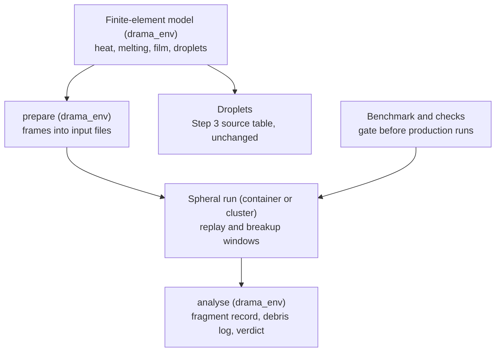
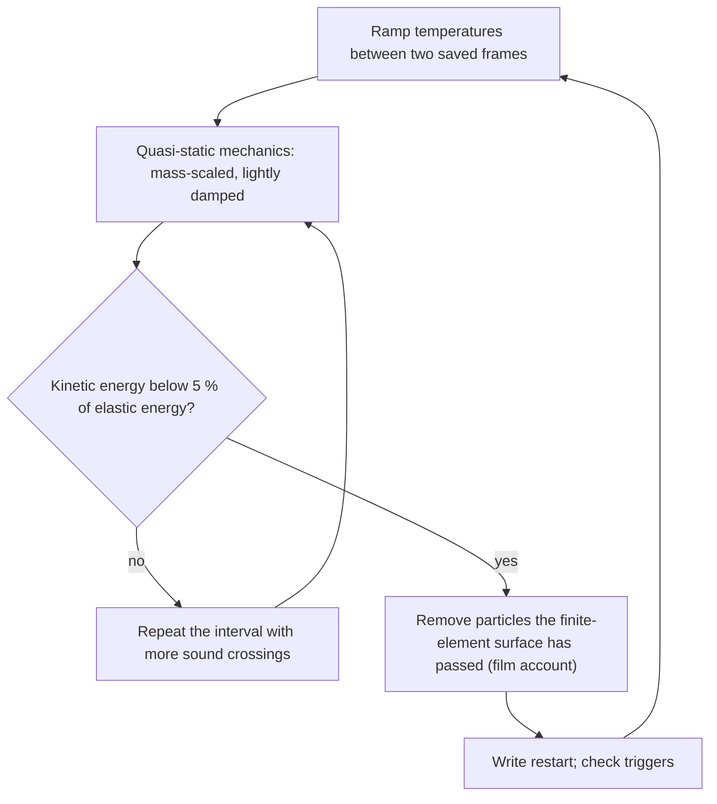
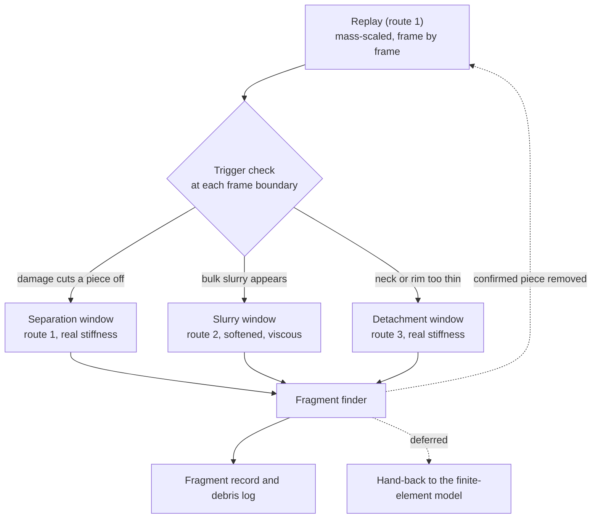
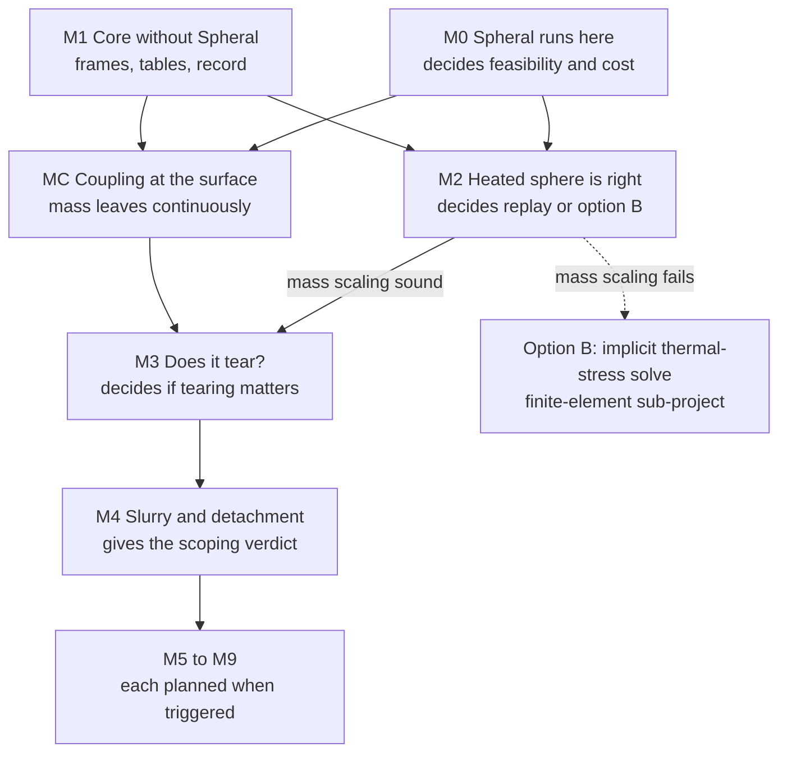

# Large fragments of the re-entering sphere with Spheral (the Spheral large-fragment model) — Design

Date: 2026-10-02
Status: design of record, presented and approved section by section with Asha between 2026-09-30 and 2026-10-02;
awaiting her review of this document; amended on 2026-10-02 with milestone MC, the coupling at the surface (§14.1), and
on 2026-10-07 with milestone M0's measurements on the laptop (§§2, 5, 8.5, 9.1, 13.2, 15, 19, 20; plan
`docs/superpowers/plans/2026-10-05-spheral-m0.md`).
Next: the implementation plan for milestones M0 and M1 only (§14).
Builds on: Step 3 (`2026-09-20-melt-spraying-design.md`; live sub-plans in
`docs/superpowers/plans/melt-spraying-subplans/`; executed prototype `prototype/proto3/`) for the flight, the heat, the
melting, the melt film and the droplets; Step 4's plan of record
(`docs/superpowers/plans/2026-09-27-deformation-ring-shedding.md`) for the material facts, the loads behind the
equator and the fragment record. Nothing in Steps 1–4 changes except the two Step 3 amendments listed in §17.

## 1. Purpose

Predict the **large fragments** of the re-entering AA7075 sphere: pieces resolved as groups of at least about 30
particles, which is about 9–12 mm on the laptop (particles 2.2–3 mm apart) and about 2 mm on the cluster (0.5 mm
apart). Step 3's Girin spraying already produces the droplets, micrometres to a fraction of a millimetre across; this
model does not repeat them. The finite-element model (`reentry_model`) keeps computing the flight, the heat, the
melting, the melt film and the droplets. LLNL's Spheral (smoothed-particle hydrodynamics: a meshfree method that
represents the body as interacting particles) computes how the body deforms and breaks.

Three purposes (Asha, 2026-09-30), served in this order:

1. **Scoping study.** Whether, when, where and by which route large pieces form on the 100 mm and 50 mm flights, and
   how far the body is from breaking (the margins).
2. **Production fragment table.** Step 4's fragment record for every large fragment along both flights, at cluster
   resolution.
3. **Plasma wind tunnel reproduction** (video `IMG_2888.MOV`). Inputs and interface now; runs when the test record
   arrives.

Two later stages were added during the design: a **check of Girin's melt spraying** on small, highly resolved surface
patches, which also produces closure tables for the finite-element film (§13.5, Asha 2026-10-02), and a **recorded
path toward a Spheral-owned surface model** (§13.6, Asha 2026-10-02).

All three routes to large fragments are accounted for (Asha, 2026-10-01):

- **Route 1, tearing.** The coherent mush in its brittle window (90–97 % solid) torn by strain from thermal
  expansion, contraction and solidification shrinkage.
- **Route 2, loss of strength.** Bulk slurry (more than half liquid and thicker than the film limit of §10) deformed
  and broken up by the aerodynamic loads and the deceleration.
- **Route 3, detachment.** Pieces that melting has nearly cut off — necks, rims, the ring or the rear cap — released
  by tearing or by remelting of their attachment.

In flight the body's own frame feels no gravity. The only body force is the drag deceleration, along the flight axis
toward the nose, so runoff collects into a ring or a rear cap (Step 4 §5 and fact 2), never a tail. In the tunnel,
gravity across the flow makes one tail (Asha, 2026-10-01).

## 2. Facts this design relies on

| Topic | Fact | Source |
|---|---|---|
| Spheral version | Pinned: the development branch at `116c71f` (28 September 2026, 16:51 UTC; still its head on 5 October), the merge of PR #520 "Bugfixes for Strain-Porosity model and Jaumann rate definition, fixes #534", the second fix to the stress-rotation (Jaumann) term: `src/SPH/SolidSPH.cc` line 767 evaluates `spinCorrection = (spin*Si - Si*spin).Symmetric()` with `spin = localDvDxi.SkewSymmetric()`. Damage in axisymmetric runs (PR #518, 14 August 2026) is an ancestor. Measured on the arm64 build: a 20 × 20 AA7075-like square in pure shear, held to an exact rigid rotation, follows R S₀ Rᵀ to 0.069 % of \|S₀\| over a quarter turn in 75 steps, with 0.003 % drift in the von Mises stress and an error second order in the step; a wrong-sign term would be off by 2 \|S₀\| at an eighth of a turn. The latest release, v2026.06.0 (23 June 2026), rotates stress the wrong way under rigid rotation. | research of 2026-09-30: releases, PR #507, issue #534, PR #518; `spheral_frag/container/pin.json`; `spheral_frag/m0/rigid_rotation.py`, commit 0f63928 |
| Platforms | Documented and tested on Linux only; no macOS or arm64 continuous integration. The only prebuilt image is `ghcr.io/llnl/spheral:latest`: linux/amd64, about 4.8 GB compressed, rebuilt on every push to the development branch. A full build took 3 h 24 min on a 4-vCPU runner, 2 h 16 min of it the Python bindings. Python 3.12, numpy 1.26 or older. **That image cannot run on Apple Silicon** (measured 2026-10-05 on digest `sha256:fee841c5…`, built 28 September 2026): it starts under Rosetta, but `import Spheral` dies with `Illegal instruction`, because Spack built 97 of its 200 package specs for `x86_64_v4` and `libSpheral_CXX.so` holds 8,751 instructions on AVX-512 registers, which Rosetta does not provide; the target comes from Spack's compiler wrapper on the build runner, not from Spheral's flags, so a later `:latest` may or may not run, and a cluster running it needs AVX-512. **Built from source instead, natively for arm64** (Asha, 2026-10-05): an `ubuntu:24.04` arm64 container under Docker Desktop following LLNL's own `Dockerfile` at `116c71f`, with no arm64 fixes needed (gcc 13.3, Open MPI 4.1.6, Python 3.12.3, numpy 1.26.4, Spack's third-party libraries for generic `aarch64`). Wall time 1 h 51 min on the Mac Studio (Python bindings 1 h 25 min at 4 jobs, `Spheral_CXX` 16 min at 16); image 16.9 GB. Spheral starts one OpenMP thread per core in every rank unless `OMP_NUM_THREADS` is set. | build guide; container manifest; Actions run 36454078958; plan 2026-10-05 fact 1; `spheral_frag/container/pin.json` and `Dockerfile`, commit 02d67b0 |
| Physics present | Elastic–plastic solids (SolidSPH, SolidCRKSPH, SolidFSISPH; axisymmetric variants of the first two). Strength: ConstantStrength, SteinbergGuinan, JohnsonCook, Collins, iSALE rock, porous, null. Damage: ProbabilisticDamageModel (Weibull flaws; cracks grow at 0.4 times the longitudinal sound speed), Grady–Kipp tensor damage, IvanoviSALEDamageModel, JohnsonCookDamage. `identifyFragments` (friends-of-friends; linking distance in smoothing lengths; damage threshold; optional attachment of dust) and `fragmentProperties`. | `src/` of v2026.06.0 |
| Physics absent | No physical heat conduction (only an artificial smoothing of energy jumps), no physical viscosity, no surface tension, no surface-traction boundary condition (only a uniform external pressure in the equation of state). | source search |
| Extensibility | Physics packages can be written in Python (README; `RadiativeLosses` in `tests/functional/Hydro/ConvectionTest/ConvectionTest.py`); `dt()` must return a Python tuple from v2026.06.0. Equation-of-state, strength and damage classes have pybind11 trampolines; Python overrides run on CPUs only. **Measured at `116c71f` (M0):** Python subclasses copying the Murnaghan and linear-polynomial equations of state and `SteinbergGuinanStrength`, and a damage model that forwards every virtual to a C++ `ProbabilisticDamageModel` except `computeScalarDDDt` (the damage rate, which the tearing law of §8.4 replaces), reproduce the built-ins **bitwise**: all 29 compared methods on synthetic inputs reaching every branch, and position, velocity, deviatoric stress, pressure, damage, density, energy and plastic strain of every particle after 110 steps on 18 processes (axisymmetric at 1.1 mm, 3,243 particles; 3D at 3.0 mm, 19,381). Exact copies repeat the fused multiply-adds that g++ 13 `-O3` forms on aarch64 (290 in SteinbergGuinan), in IEEE quad precision; plain numpy arithmetic ends 1.7e-11 (3D) and 3.0e-11 (axisymmetric) of the largest velocity and stress away. An x86-64 cluster build contracts differently (unmeasured). Added cost per step: the Cost row. Untried: Python update policies, which the tearing law will probably also need (its flaw activation and its strain replace `ProbabilisticDamagePolicy` and the strain policy; trampolines exist). | `src/PYB11/Physics/Physics.py`; release notes; `spheral_frag/m0/subclass_check.py`, commit 091c2bc |
| Traps | The library's aluminium uses atomic weight 24.032 (real 26.98), so its Dulong–Petit heat capacity is 1,038 J/(kg·K). **The Grüneisen equation of state returns dP/dρ = ρ₀C₀² instead of C₀² for ρ ≤ ρ₀** at `116c71f` (introduced in c77981253, 2023-08-29; reaching the sound speed and bulk modulus through `computeDPDrho` since 18a8420d1, 2023-09-26; no upstream issue): in SI its sound speed at rest and in tension is √ρ₀ = 53 times C₀ for aluminium, the damage model's longitudinal sound speed 44 times too high and the step 44–53 times too small (found through Spheral's time-step votes, 2026-10-06); its temperature relation is also unit-inconsistent (read from the code, untested). This design does not use it (§8.2: a custom equation of state, and Murnaghan, whose sound speed √(K/ρ₀) was checked correct on both sides of ρ₀ in SI and CGS); the custom equation of state must give the sound speed and bulk modulus consistently with its own dP/dρ, since the damage model reads them. JohnsonCookDamage's thermal term is silently inactive unless paired with SteinbergGuinan strength. The default damage strain (PseudoPlasticStrain) ignores hydrostatic tension; StrainHistory and MeloshRyanAsphaugStrain count free thermal expansion as tensile strain. `Physics::appendBoundary` is not virtual, so a Python package that delegates to a C++ one must copy its boundaries (in parallel the distributed boundary) to the delegate, or the delegate fills no ghost values (a 2-process run drifted by 1e-11 in 7 steps). `controller.step()` forces a global sum, a print and garbage collection after every step. | `MaterialPropertiesLib.py` line 170; `GruneisenEquationOfState.cc` lines 262–305 and `pressureAndDerivs`; `JohnsonCookFailureStrainPolicy.cc` line 106; `TensorStrainPolicy.cc` lines 102–140; `Physics/Physics.hh` line 98; `spheral_frag/m0/bench.py` (commit 90b38d5) and `subclass_check.py` (commit 091c2bc) docstrings |
| Particle placement | A lattice clipped to a closed surface (`PolyhedralSurfaceRejecter`, `fillFacetedVolume2`), or a centroidally relaxed fill of an arbitrary closed surface (`MedialGenerator3d(n, rho, boundary=FacetedVolume, …)`). Surface particles by `detectSurface` or `VoronoiCells.surfacePoint`. | `src/NodeGenerators/`; `src/CRKSPH/detectSurface.hh` |
| Time stepping | Explicit integrators (CheapSynchronousRK2 and others), Courant number 0.25 by default. Implicit CrankNicolson and BackwardEuler exist but are exercised only by one-dimensional tests. | `GenericHydro::dtImplicit`; test scripts |
| Cost (measured on the laptop; cluster not yet measured) | Measured at `116c71f` on the Mac Studio (Apple M5 Max, 18 cores, 64 GB; Docker Desktop's Linux VM with 18 CPUs and about 47 GB), native arm64 with no Rosetta (the cluster will be x86-64): SolidSPH with SteinbergGuinan strength on a Murnaghan equation of state, the 100 mm sphere, 100 timed steps after 10 warm-up steps, start-up excluded. **3D: 3.2–4.4 × 10⁻⁵ processor-seconds per particle per step** (19,000–394,000 particles on 18 processes; median step 0.047, 0.10, 0.30 and 0.71 s at 3.0, 2.2, 1.5 and 1.1 mm, damage off). **Axisymmetric: 2.7–9.3 × 10⁻⁶** (800–52,000 particles; 2.5 ms at 2.2 mm on 1 process, 3.4 ms at 1.1 mm on 6, 6.7 ms at 0.55 mm and 19 ms at 0.275 mm on 18). `ProbabilisticDamageModel` adds 5–10 % in 3D and 12–25 % in axisymmetric runs on an intact body (no flaw activated; a breaking body is unmeasured). Parallel efficiency on 18 processes: 0.51 in 3D at 49,000 particles, 0.29–0.31 axisymmetric at 13,000. Peak memory: a fixed 250–300 MiB per process plus 7–11 KiB per particle (8.9 GB for 394,000 particles on 18). Hence about 77 ms of simulated time per day for 50,000 particles in 3D at real stiffness (damage on), 2–16 times cheaper per particle than the 0.1–0.5 ms first estimated. **The Python material classes** (all three together, the Extensibility row) add 19.7 % to a 47.5 ms 3D step (3.0 mm, about 1,080 particles per process) and 79.6 % to a 3.45 ms axisymmetric step (1.1 mm, about 180 per process); separately 5.0, 13.2 and 3.5 % (3D) and 18.7, 41.1 and 33.9 % (axisymmetric) for the equation of state, strength and damage; a repeat of the built-in run came out 2.3 and 2.0 % slower, the noise floor. The overhead is mostly per call (Field transfers on about 30 virtual calls a step), so it is a large share of a small step. Cluster (estimate, from the first estimate of 0.1–0.5 ms): about 2.5–18 ms per day for 500,000 particles on 256 cores. The largest published runs: 3.9 million particles on 1,680 processors for 59 days reached 145 ms; each 3D airburst run used over 10⁶ processor-hours. | `data/spheral/m0_benchmark.csv` and `analysis/spheral_m0_benchmark.py`, commit 6b898d4; `spheral_output/m0/subclass/summary.json`, commit 091c2bc; research of 2026-09-30; Santistevan et al. 2026; Stokes et al. 2025 |
| Explicit step in AA7075 | Longitudinal sound speed about 6.1 km/s (Young's modulus 71.7 GPa, Poisson's ratio 0.33, density 2,813 kg/m³; 6,170 m/s for the benchmark's bulk modulus of 70.3 GPa and shear modulus of 27.6 GPa). **Spheral's own step, measured** (its time-step vote; Courant number 0.25, WendlandC4 kernel, 2.01 smoothing lengths per spacing, CheapSynchronousRK2): dt = 4.54 × 10⁻⁵ s/m × Δx in 3D and 4.43 × 10⁻⁵ s/m × Δx in axisymmetric runs, so sound travels 0.28 spacings per step: 0.136 µs at 3.0 mm, 0.100 µs at 2.2 mm (3D; 0.097 axisymmetric), 0.050 µs at 1.1 mm, 0.024 µs at 0.55 mm and 0.012 µs at 0.275 mm; about 11 ns at 0.25 mm. The first estimate (0.09–0.12 µs at 2.2 mm, 0.04–0.06 µs at 1 mm, about 15 ns at 0.25 mm) held. | research; `data/spheral/m0_benchmark.csv` (`dt_median_s`), commit 6b898d4 |
| Softening precedent | Korneyeva et al. (2026, Icarus 449, 116964) modelled nylon spheres in a Mach 4 tunnel with a Murnaghan equation of state (exponent 1), bulk modulus 100 MPa, Poisson's ratio 0.2 and the real density 1,120 kg/m³, to keep the spheres quasi-rigid without the time step being set by their stiffness. | paper text |
| Flight loads (100 mm, Step 2 physics run) | Dynamic pressure peaks at 16.6 kPa at 152.5 s (41.0 km); deceleration peaks at 8.2 g. Flight-path angle −2.0° at 80 s, −7.9° at 160 s, −26.5° at 200 s, −89.4° at 300 s. | `reentry_model_output/verification_thermal/d100__physics.csv` |
| Material (`AA7075_scheil`) | f_l = ((933 − T)/25)^(−1/0.6) (partition coefficient 0.4); liquidus 908 K; half solid at 895.1 K; 3.6 % eutectic liquid melting over 748–752 K at the 750 K solidus; latent heat 390 kJ/kg; c_p held at 1,131.6 J/(kg·K) above 850 K; conductivity 128 W/(m·K) at 850 K; solid 2,813 kg/m³; liquid 2,400 kg/m³, 1.3 mPa·s, 0.80 N/m. | sub-plan 02, amendments of 2026-09-27 and 2026-09-28; Step 4 plan §4 and material values |
| Mush and slurry laws | Chen et al. (2016) Eq. 20: semi-solid branch to f_l = 0.5, plastic branch as the solid limit (peak stress of extruded T6 7075 at 350–600 °C and 10⁻³–1 s⁻¹). Li et al. (2014): slurry viscosity 0.87–5.6 Pa·s, shear rate held at no more than 367 s⁻¹, bridged to the liquid over 906.4–908 K. | Step 4 plan §4 |
| Brittle window and tearing | As-cast AA7050 in tension (Subroto et al. 2021; 465–550 °C; 0.2 and 2 mm/min): ductile from 100 to 97 % solid, brittle from 97 to 90 %, ductile again from 90 to 85 %. Critical strain of order 0.1 % (Step 4's summary of Subroto 2014 and 2021, not yet checked against the full text, §16). On the Scheil curve the window spans 833 K down to the eutectic; at the nose (8–15 K per mm) it is 5.5–10 mm thick. | Subroto et al. 2021 abstract; Step 4 plan |
| Thin surface layers | Girin's conjugate depth 215–303 µm (fact 28); per patch 143–421 µm in the 100 mm frames, and undefined (NaN) on every patch of the 50 mm flight, which never has Girin's closure (Step 3 amendment of 2026-10-02). Contiguous molten layer 0.35–0.89 mm, thicker than the conjugate depth in every step; film account 1.7 µm–3.3 mm; median droplet radius 122 µm (100 mm flight) and 236 µm (50 mm). | Step 3 shared context, facts 12 and 28; amendment of 2026-10-02 (facts 46–53) |
| Molten backlog (time-step artefact) | At the default 0.5 s step the surface recedes through at most one molten element per step, so liquid waits below the conjugate depth: median 4.75 g at 0.5 s, 0.23 g at 0.25 s, 0.004 g at 0.125 s (100 mm, to 120 s); mean molten-layer depth 1.26, 0.28 and 0.066 mm; deepest contiguous molten layer about 18–21 mm at 0.5 s. The droplet population (count, thick/thin split, median radius) is not converged in the step even at 0.125 s; sprayed and surviving mass hold to a few percent. The new deep runoff's effect vanishes at short steps. | Step 3 amendment of 2026-10-02, time-step study (sub-plan 14; facts 46–53) |
| Ring supply and state | About 1 % of the melt reaches the last windward row (Step 4 fact 1, measured before the dense band); re-measured on the current prototype's true equatorial ring (patches beyond 0.9 of the transverse radius): 4.0 % on the 100 mm flight (25.5–80 s) and 7.7 % on the 50 mm flight. The film at the equator is at most 0.09 mm (100 mm). The equator stays at 508–833 K (100 mm) until about 65 s, so the ring starts as an accretion. The 100 mm remnant (0.49 kg) stays at 820–905 K to 400 s at 1–10 g. Stripping at the equator is marginal (rim Weber number 4.5–13.6). | Step 4 plan, facts 1, 2, 3, 5, 7; Step 3 amendment of 2026-10-02 |
| Particle identity and mass | No persistent particle ID: local indices change on deletion and redistribution, and global IDs re-sort by position, so a permanent ID must be a user-created integer field filled once at the start (registered fields follow particles through deletion and MPI redistribution). `identifyFragments` numbers are per-call labels. Mass is a per-particle field that SPH, CRKSPH and solid FSISPH never change; a custom package can attach an update policy to it; the default SPH density update is summation, which interacts badly with shrinking masses, and `IntegrateDensity` is available. SolidCRKSPH exists; of its volume types only `MassOverDensity` depends on mass. Within one node list the smoothing-length update weights neighbours by position only, not by mass. | read from develop at 116c71f on 2026-10-02 (another session's note), untested; `Physics/GenericHydro.hh` line 19, `VoronoiCells/VolumeType.hh` line 11, `SmoothingScale/SPHSmoothingScale.cc` lines 206–218 |
| Finite-element cost | The 100 mm melting flight took 1,191 steps of 0.5 s and 2,357 s of wall time. Meshes: 18,896 nodes (Step 2), 33,355 nodes with the dense band; outermost prism layer 0.25 mm. | Step 3 fact 12; `reentry_model_output/meshes/` |

## 3. Scope

**In the first version (milestones M0–M4 and MC, §14):**

- Installation, version pinning and the measured cost (§5).
- The Spheral-free core: frame import, material and load tables, thickness map and three-zone classification,
  fragment record, debris log and mass accounts (§§6–11).
- The replay of the slow history for route 1 and the breakup windows for routes 1–3, in axisymmetric and 3D form,
  with the particle spacing as a setting (§9).
- One AA7075 material model covering solid, mush, slurry and liquid (§8).
- Aerodynamic loads and the deceleration applied to the current particle surface (§7).
- The viscosity package for slurry; the heating package for long windows; the spray mass sink and permanent particle
  IDs (§§8–10, §14.1).
- The checks against exact solutions (§12) and the axisymmetric scoping study on both flights (§13.2).

**Built only when triggered (M5–M9, §14):** the 3D fragment table; the hand-back to the finite-element model or the
start of the Spheral-owned surface model; the tunnel case; the film-and-spray patches; the Spheral-owned surface model.
The surface-tension package is built with the first of these that needs it (liquid rims at fine resolution, the tunnel,
the patches).

**Out of scope:** the fate of separated fragments — their trajectory, further heating and demise; Asha noted on
2026-10-02 that separated solid fragments keep heating as they slow down, which is that later, higher-resolution
iteration's business — tumbling; the oxide skin; simulating the air (except the optional gas-particle patches of
§13.5); self-contact beyond what particles do naturally.

## 4. Architecture

### 4.1 Split by time scale

The slow, diffusive, thin-layer processes stay in the finite-element model; the mechanics goes to Spheral (Asha,
2026-10-01). The finite-element model solves only for heat, implicitly, with 0.5 s steps chosen for accuracy (halving
them moved the peak surface temperature by 0.04 %), on a graded mesh whose surface cells are 0.25 mm deep and about 2 mm
wide. Spheral steps explicitly; its step shrinks with the particle spacing, and its particles must be roughly round, so
resolving 0.25 mm would take about 4 million particles in the outer 2 mm shell alone and steps of about 15 ns. The
surface layers that matter for melting, feeding, the film and spraying are 0.2–3 mm thick (§2), 2–10 times thinner than
Spheral's particles. Spheral therefore only has to resolve millimetre-scale structure: bulk slurry, necks, rings and
fragments.

### 4.2 Stages and their files

Three stages, which communicate only through files:

- `prepare` (drama_env) reads a finite-element run directory and writes plain input files (NumPy arrays and JSON).
- `run` (Spheral's own Python, in the container or on the cluster) reads only those inputs and writes its outputs.
- `analyse` (drama_env) reads only the run's outputs.

This follows the rule `viz` already obeys (exported files, never live objects), keeps Spheral's Python free of
Cantera, pymsis and PyVista, and makes every cluster run reproducible from its input files.



### 4.3 Package layout (provisional; the plan fixes names)

```
spheral_frag/                 Spheral-free core, tested in drama_env
  frames.py                   read finite-element frames and history; write run inputs
  material.py                 AA7075 tables (energy–temperature, liquid fraction, free density, moduli) and the
                              flow-stress, viscosity and tearing laws as plain functions
  loads.py                    load tables by inclination (frames' wall pressure and shear; §7's lee extension)
  geometry.py                 thickness map, three-zone classification, centre-crossing removal
  record.py                   fragment record, debris log, mass accounts, Weber and Ohnesorge numbers, breakup flag
  naming.py                   run names
  prepare.py, analyse.py      command-line entry points
  runner/                     needs Spheral; runs under Spheral's Python only
    run.py                    the run script: replay and windows
    eos.py, strength.py, damage.py    Spheral subclasses calling the core's laws
    packages/                 loads, imposed temperature, mass-scaling bookkeeping, viscosity, surface tension,
                              heating, spray sink
    windows.py                triggers, configuration switches, end conditions
    fragments.py              fragment finder wrapper, dust attachment, record rows
analysis/spheral_*.py         scoping verdict, tables and plots
tests/test_spheral_frag_*.py          core tests (drama_env)
tests/test_spheral_frag_runner_*.py   runner tests, pytest marker `spheral`
spheral_output/               git-ignored outputs
```

### 4.4 Environments, tests, outputs and names

- `PY` (drama_env) runs the core and the analysis. A new `SPHERAL` variable holds the Spheral launch command: the
  container command on the laptop; the installed launcher or the Apptainer command on the cluster.
- A `spheral` pytest marker, declared in `pytest.ini` and skipped automatically by `tests/conftest.py` when Spheral is
  not importable, exactly as `drama` is now.
- The repository path contains spaces (including one before `/MIT`); container scripts mount the repository through a
  link whose path has none.
- Outputs go to the git-ignored `spheral_output/`. Run names encode the whole configuration — the finite-element run's
  name, the route or window, the frame or frame range, axisymmetric or 3D, the spacing, the bracket settings and the
  seed — so runs share one output directory without overwriting each other, and studies resume by checking for a run's
  summary file (the repository's convention).
- The Spheral commit and container digest are pinned in a committed file and copied into every run's metadata.
- Exit codes as in `reentry_model`: 0 success, 1 a model failure (message printed), 2 bad arguments or a missing
  optional library.

## 5. Installation, environments and the benchmark (milestone M0)

M0's laptop half was done between 2026-10-05 and 2026-10-07 (plan `2026-10-05-spheral-m0.md`); its cluster half is
deferred (Asha, 2026-10-05) until the cluster is known (§16, item 6).

- **Version.** The development branch at or after 28 September 2026, for the stress-rotation fix and damage in
  axisymmetric runs. M0 checks that `src/SPH/SolidSPH.cc` carries the corrected rotation term. *Done:* pinned at
  `116c71f`, which carries it, and checked numerically (§2, Spheral version).
- **Laptop.** *Done as a native arm64 source build* (Asha, 2026-10-05), because LLNL's x86-64 image cannot run under
  Rosetta (§2, Platforms): `spheral_frag/container/` holds the `Dockerfile` (LLNL's recipe at `116c71f`, cloned by full
  SHA), `build.sh`, `pin.json` (commit, image digest, toolchain, build times) and `spack-find.txt`, and the launcher
  `spheral`, which runs a script in the image on one rank or under `mpirun` (root allowed, 8 GB shared memory, one
  OpenMP thread per rank) and exits 2 when Docker or the image is absent; the `spheral` pytest marker skips on that
  probe. Built in 1 h 51 min, under the 3–4 hours estimated. The Rosetta container and the virtual-machine fallback
  are not needed.
- **Cluster** (deferred). Apptainer running LLNL's image (identical environment, simplest for one node) only on nodes
  with AVX-512, which that image requires (§2, Platforms); otherwise, or for runs across several nodes, a source build
  with LLNL's third-party-library manager (supported on Rocky and Red Hat Enterprise Linux 8), which the arm64 build
  shows to work from the same recipe.
- **Smoke tests.** LLNL's regression examples `TaylorImpact.py` and `TensileRod-1d.py` reproduce their regression
  results. *Done on the laptop:* `TensileRod-1d` (the ATS lines t10–t13 and t20–t23: serial with `--checkRef`, 4
  domains, restarts from cycle 500) passes, every output file of the 4-domain and restarted runs is byte-identical to the
  serial run, and the largest relative difference from LLNL's reference files is 8.8e-6 (`GradyKippTensorDamageOwen`)
  and 1.2e-5 (`ProbabilisticDamageModel`), within the comparison's 1e-4; `TaylorImpact` (SPH, 100 steps), which has no
  stored reference, runs to completion in 2D and axisymmetric form on 1 and 8 processes and in 3D on 8 (commit
  d61b194).
- **Benchmark.** On both machines: processor time per particle per step for SolidSPH with strength, with and without
  damage, in 3D and axisymmetric form, at two or three particle counts; memory per particle; scaling with the number of
  processes. These measurements replace §2's estimates everywhere in this design. *Done on the laptop:* 36 runs at four
  spacings in each form and two scaling series (3D at 2.2 mm and axisymmetric at 0.55 mm on 1–18 processes),
  `data/spheral/m0_benchmark.csv`; results in §2 (Cost, Explicit step).
- **Python subclasses.** A minimal Python subclass of the equation-of-state, strength and damage classes, set to mimic
  a built-in class, must give the built-in's results; its added cost per step is measured. *Done on the laptop:*
  bitwise identical; the cost in §2 (Extensibility, Cost).
- **Decision gate.** If a 3D replay at 50,000 particles would take more than about a week on the laptop, the laptop
  runs only axisymmetric replays and short 3D windows. If the subclasses fail or add more than about a quarter of a
  step, the material model is written in C++ in a source build. The replay is costed over the hot phase only (Asha,
  2026-10-05).

**Gate outcome (2026-10-07): the first part passes; the second is split, and Asha accepted the axisymmetric
overhead (2026-10-07, §20).** Reproduced by `analysis/spheral_m0_benchmark.py --gate` from the committed table.

- *Hot phase.* Melt onset to the end of spraying on the 100 mm physics flight: 25.5–225.0 s, 199.5 s, 399 intervals of
  0.5 s. No run directory of that flight exists (Step 3 is not yet in `reentry_model`), so both ends come from the Step 3
  shared context's facts (`melt-spraying-subplans/00-shared-context.md`): 25.5 s is the start of its window "while the
  equator is intact", which on the 50 mm flight begins at that flight's melt onset (174.5 s, sub-plan 02); 225.0 s is
  the end of spraying in the seeded whole flight to the ground at the default step without the deep runoff, which lands
  at 582.5 s. The Scheil material melts slightly earlier (2.5 s on the 50 mm flight).
- *Steps.* §9.1's mass scaling at Spheral's measured step: D / (c_l dt) steps per sound crossing of the 100 mm
  diameter, at the cold c_l of 6,170 m/s (an upper bound: the body shrinks and softens), times 10 crossings per
  interval.
- *Wall time* = steps × the measured median step (damage on), and the same with the measured Python overhead of that
  form.

| Form, spacing | Particles, processes | Median step | Steps per 0.5 s | Steps over the hot phase | Wall time | With the Python classes |
|---|---|---|---|---|---|---|
| 3D, 3.0 mm | 19,381 on 18 | 49.8 ms | 1,190 | 475,000 | 6.6 h | 7.9 h |
| **3D, 2.2 mm** | **49,173 on 18** | **113 ms** | **1,620** | **647,000** | **20.3 h** | **24.3 h** |
| 3D, 1.5 mm | 155,331 on 18 | 318 ms | 2,380 | 950,000 | 84 h (3.5 days) | 101 h |
| 3D, 1.1 mm | 393,719 on 18 | 760 ms | 3,250 | 1.29 million | 274 h (11.4 days) | 328 h |
| Axisymmetric, 2.2 mm | 813 on 1 | 3.0 ms | 1,660 | 663,000 | 0.6 h | 1.0 h |
| Axisymmetric, 1.1 mm | 3,243 on 6 (on 18) | 4.2 ms (3.45 ms) | 3,330 | 1.33 million | 1.6 h (1.3 h) | 2.8 h (2.3 h, measured) |
| Axisymmetric, 0.55 mm | 12,977 on 18 | 7.6 ms | 6,650 | 2.65 million | 5.6 h | 10.1 h |
| Axisymmetric, 0.275 mm | 51,932 on 18 | 21 ms | 13,300 | 5.31 million | 32 h | 57 h |

"With the Python classes" multiplies by the fraction measured for that form, +19.7 % in 3D (at 3.0 mm) and +79.6 %
axisymmetric (at 1.1 mm, the bracketed entries: 3.45 ms built-in against 6.20 ms in Python), both on 18 processes; at
other spacings and process counts the fraction is not measured.

- *First part: passes.* The 3D replay at 50,000 particles takes 20 hours over the hot phase (24 with the Python
  classes), a seventh of a week; the whole flight to the ground at the same rate would take 59 hours. **The laptop is
  not restricted to axisymmetric replays and short 3D windows**: a 3D replay at 2.2 mm fits in a day. 3D at 1.1 mm
  (11–14 days) and anything finer stay on the cluster.
- *Second part: split.* The subclasses do not fail (bitwise identical). In 3D they add 19.7 %, within the quarter of a
  step. In the axisymmetric form on 18 processes they add 79.6 %, over it. Read literally, the gate sends the material
  model to C++ for axisymmetric runs; in absolute terms the axisymmetric replay at 1.1 mm takes 2.3 hours in Python
  against 1.3 in C++. Asha chose (2026-10-07) to accept the overhead: axisymmetric runs keep the Python classes, since
  they cost hours, not days (§20); C++ classes and fewer processes are recorded as alternatives (§19).

## 6. Inputs and the particle body

### 6.1 What `prepare` reads and writes

From a finite-element run directory: each frame's `field_<k>.vtu` (the active tetrahedra — the body's current shape —
with nodal temperature and liquid fraction) and `surface_<k>.vtp` (surface triangles with wall pressure `p_w`, wall
shear `tau`, convective flux `q_conv`, film thickness and temperature, the per-step released spray mass
`release_rate`, and — after the Step 3 amendment of §17 — the conjugate depth `delta_m` and the deep liquid's
thickness `deep_thickness`); the history CSV (time, flight state, wall stagnation pressure, deceleration, mass).
`deep_thickness` from runs at the default 0.5 s step is a time-step artefact (§2, molten backlog) and is not read as
physical. For each frame it writes one compact NumPy file (surface
triangulation, tetrahedra with temperature and liquid fraction, per-patch fields) and, per run, one JSON file
(material, flight, frame times) plus the material table (§8). The replay needs a frame at every 0.5 s macro step
(`frames_every = 1`): about a gigabyte per flight.

### 6.2 Building the body

The runner turns the surface triangulation into a closed Spheral polyhedron and fills it at the chosen spacing: a
clipped lattice for quick tests, the centroidally relaxed generator for production (a setting). Every particle gets a
permanent integer ID in a field registered at creation, because Spheral keeps none of its own (§2); the IDs carry
provenance through removals, restarts, configuration switches and MPI redistribution, and they match fragments from one
check to the next (§11.1). Spacing is the
resolution setting: about 2.2–3 mm on the laptop, down to about 0.5 mm on the cluster; a finer outer shell over a
coarser core is a later option. In axisymmetric mode the same is done in the half-plane through the flight axis; at
fixed attitude the thermal field and the loads are the same in every such plane. Each particle there stands for the
ring it traces around the axis, so its mass grows in proportion to its distance from the axis, and every separated
piece is a body of revolution: a ring (torus) if it does not touch the axis, a cap centred on the axis if it does.

### 6.3 Fields on the particles

Each particle takes the temperature and liquid fraction at its position by linear interpolation in the containing
finite-element tetrahedron (axisymmetric runs sample the meridional plane). Its thermal energy is then set from §8's
own energy–temperature table, never from Spheral's. Check: the particles' total heat content matches the
finite-element model's within a tolerance stated for each spacing; a 2.2 mm particle at the nose spans 18–33 K, so
coarse runs smooth the surface layer, and the check measures by how much.

### 6.4 Starting without a thermal shock

- **The replay** starts at the beginning of the flight, unstressed at a uniform 300 K, and brings the temperature
  history in frame by frame (§9.1).
- **Separation and detachment windows** start from the replay's restart at their frame, carrying stress, plastic
  strain and damage.
- **Slurry windows** start from a frame directly, free of stress: their material has no thermal pressure term (§8.2),
  so temperature changes strength and viscosity only.
- **Tunnel case.** The same inputs from a finite-element tunnel run (Step 4's planned Task 13) or, failing that, from
  §9.4's heating package starting at a uniform temperature; the sample holder is represented by fixed particles.

## 7. Loads and body forces

### 7.1 Body force

- **Flight.** The frame decelerates with the body, so every particle receives the same acceleration toward the nose,
  along the flight axis; gravity is not applied. The runner computes the deceleration every step as the total
  aerodynamic force on the main body divided by its mass, which keeps the body at rest in its own frame; agreement with
  the history's deceleration within a few percent checks the surface loads. After a separation the frame follows the
  largest piece; loose pieces keep receiving the frame acceleration plus their own aerodynamic loads.
- **Tunnel.** Gravity in a chosen direction, no deceleration, the holder's particles fixed.

### 7.2 Surface loads

Each step, or every few steps:

1. Surface particles and their outward normals from Spheral's surface detection.
2. **Exposure.** Along lines parallel to the flight axis, the most upstream particle is exposed. Particles hidden
   behind other material (pits, the wake of the body, a separated piece in that wake) receive only the base pressure.
3. **Load tables by local inclination** (the angle between a particle's outward normal and the oncoming flow). The
   windward part comes from the frame's own `p_w` and `tau`, binned by inclination, so on the undeformed body Spheral
   sees the finite-element model's loads exactly. Behind the last patch the frame carries loads for, a lee extension
   following Step 4 §5 applies until Step 4's lee-load module exists: the pressure expands down to a base pressure of
   1, 3 or 5 % of the stagnation pressure (default 3 %) and then stays constant out to a separation angle of 180°
   (bracket 150°); the lee shear is a placeholder held at half the last windward value (bracket: zero and the full
   value). Labelled as Step 4's model, to be replaced by its module.
4. **Forces.** Each stress times the particle's share of surface area, divided by its mass, is added to its
   acceleration. The share starts as the particle volume to the power two-thirds, calibrated so that the shares add up
   to the body's real surface area (or Spheral's Voronoi exposed-face areas if they prove reliable). Shear acts along
   the surface in the direction of the oncoming flow projected onto it.

### 7.3 Checks and limitations

On the undeformed sphere at a chosen frame, the integrated drag matches the finite-element model's within a few
percent and the pressure along the surface reproduces the table; the same per ring in axisymmetric mode.
Limitations: loads by local inclination ignore how a deforming shape changes the flow (shock position, separation),
as in Step 4 until a CFD solution exists; the exposure test is crude for strongly concave shapes; the lee loads are
uncertain by a factor of a few (Step 4's risk).

## 8. Material model

### 8.1 One material, every state

One model covers solid, coherent mush, slurry and liquid, keyed on each particle's temperature and Scheil liquid
fraction. `prepare` tabulates the finite-element run's own material file (`AA7075_scheil`) at every kelvin: enthalpy
from 300 K including the latent heat, liquid fraction, free density and moduli. Spheral and the finite-element model
therefore share one curve, and the runner needs no copy of `reentry_model`.

**Energy and temperature.** A particle's thermal energy is the finite-element enthalpy measured from 300 K, latent
heat included; its temperature is read back from the same table. Spheral's built-in temperature relations are not
used (§2, traps).

### 8.2 Pressure and volume

P = K · (ρ / ρ_free(T, f_l) − 1), where K is the bulk modulus at the particle's temperature, ρ its density, and
ρ_free the density it would have if nothing pushed or pulled on it — falling with thermal expansion and with the volume
change on melting. Thermal expansion and solidification shrinkage are therefore explicit, and latent heat never becomes
pressure. Implemented as a custom equation of state. The softened route-2 configuration uses Spheral's Murnaghan
equation of state (exponent 1) with one reference density and a bulk modulus of 30 MPa: pressure from compression only.

### 8.3 Strength and viscosity

One flow-stress law, evaluated at each particle's actual strain rate (physical in the mass-scaled replay):

| State | Range | Flow stress | Shear modulus |
|---|---|---|---|
| Solid | below 623 K | handbook yield strength of 7075-T6 against temperature, short exposure (open input 1) | handbook E(T), Poisson's ratio 0.33 |
| Hot solid | 623 K to the solidus | Chen 2016 plastic branch | handbook E(T) |
| Coherent mush | to 50 % liquid (895.1 K) | Chen 2016 semi-solid branch, falling to zero at 50 % liquid | E(T) reduced linearly to zero at 50 % liquid (labelled assumption, open input 4) |
| Slurry | 50 % liquid to 908 K | no yield; viscous: equivalent stress = 3 × viscosity × equivalent strain rate, with Li et al.'s viscosity and the bridge | none |
| Liquid | above 908 K | viscous, 1.3 mPa·s | none |

The viscous rows are implemented inside the same custom strength model, which Spheral already hands the strain rate
(option (a)); a separate viscous-force package after Morris, Fox and Zhu (1997) is the alternative (option (b)),
chosen by M4's viscous checks. In the stiff replay slurry only transmits pressure; how it flows is the slurry windows'
job. The softened configuration scales the shear modulus with the bulk modulus (Poisson's ratio kept), holds the
coherent core intact, and uses the viscous rows for slurry and liquid.

### 8.4 Damage: tearing in the brittle window only

- **Where.** Particles between 90 and 97 % solid (833 K down to the eutectic on the Scheil curve).
- **Strain.** While a particle is in the window it accumulates its mechanical tensile strain: the largest principal
  stretch beyond what free thermal expansion and melting would give, as a fraction of length. Free expansion never
  counts. The accumulation starts from zero on entering the window; it is kept but stops growing if the particle
  solidifies fully, and is reset if the particle melts past 10 % liquid.
- **When.** At a critical strain of 0.1 % (one part in a thousand; Step 4's placeholder), run as the bracket 0.05,
  0.1, 0.3 and 1 % (open input 3). Each particle's critical value is drawn from a normal distribution with a 10 %
  relative spread, truncated at three spreads, from a fixed seed (a labelled numerical device that keeps a symmetric
  body from tearing everywhere at once); three seeds per case.
- **How.** Damage then grows across the particle at 0.4 times the longitudinal sound speed, as in Spheral's own
  models, along the direction of greatest tension; torn material can be pushed but not pulled across the crack.
- **Elsewhere, none.** The mush above 10 % liquid deforms by flowing; slurry and liquid separate by flowing; the solid
  below the window records its peak plastic strain, flagged above a ductility bracket starting at 10 %. A ductile
  failure law is added only if that flag fires.

### 8.5 Implementation

Python subclasses of Spheral's equation-of-state, strength and damage classes, working on whole arrays with NumPy. M0
proves the mechanism; if it fails or costs more than about a quarter of a step, the classes are written in C++ in a
source build. *M0 (2026-10-07):* the mechanism works, bitwise; 3D pays 19.7 %, the axisymmetric form on 18 processes
79.6 % (§2, Extensibility and Cost); the axisymmetric runs keep Python at that cost (Asha, 2026-10-07; §19, §20). The source build
exists already (§5). The tearing law will probably also need Python update policies (flaw activation and strain), not
yet tried.

## 9. The replay, the windows and the hand-over between them

### 9.1 The replay (route 1's slow history)

- **Advance.** Frame to frame (every 0.5 s; frames may be skipped where every particle's temperature changes by less
  than 5 K). Within an interval, each particle's temperature is interpolated linearly in time at its current position
  and its energy set from the table; Spheral's plastic-work heating is overwritten (10 MPa through 1 % plastic strain
  heats the metal by about 0.04 K).
- **Mass scaling** (a labelled numerical device). The density is multiplied by a fixed factor so that sound crosses
  the body a set number of times per interval: default 10, bracket 5 and 20, fixed by the heated-sphere check (§12).
  Consistent rescalings: the energy per kilogram and the free density in the pressure law; the deceleration follows
  automatically from the scaled masses. With 10 crossings the 100 mm sphere needs a density factor of about ten million
  (9.5 million: sound crosses the 100 mm diameter in 16.2 µs at 6,170 m/s, and must take 0.05 s). Sound speed and step
  scale alike, so the steps per crossing are Spheral's unscaled ones, D / (c_l dt): at the measured step (§2) 119 at
  3.0 mm and 162 at 2.2 mm. Hence about 1,620 steps per 0.5 s interval at 2.2 mm, about 325,000 per 100 s of the hot
  phase, scaling as 1/Δx (3,330 per interval at 1.1 mm, 6,650 at 0.55 mm). The first estimate here, 1,200 per
  interval and 240,000 per 100 s, is what the measured step gives at 3.0 mm.
- **Damping.** Light damping (a labelled device) removes the ringing each increment excites; the heated-sphere check
  shows it leaves the balanced state unchanged.
- **Slow enough.** Kinetic energy is kept below 5 % of the stored elastic energy; otherwise the interval is repeated
  with more crossings.
- **Material leaving.** At each frame boundary, particles whose centres the finite-element surface has passed are
  removed to the film account with their mass and enthalpy (§10).
- **Restarts** at every frame boundary: any window can branch from any frame, and an interrupted replay resumes.
- **Cost (measured step, 2026-10-07; §5's gate table).** Over the 100 mm hot phase (199.5 s), damage on, built-in
  material classes, and in brackets with the Python classes at their measured overhead: axisymmetric 0.6 h at 2.2 mm (1.0
  h), 1.3 h at 1.1 mm (2.3 h), 5.6 h at 0.55 mm (10 h); 3D on the laptop 20 h at 2.2 mm (24 h), 3.5 days at 1.5 mm and 11
  days at 1.1 mm. 3D replays at 2.2 mm therefore fit on the laptop; finer 3D replays belong on the cluster. A breaking
  body's damage cost and the tearing law's own cost are not in these numbers.



### 9.2 Triggers

Checked at every frame boundary:

1. **Route 1, separation.** The fragment finder sees a group no longer linked to the main body through undamaged
   particles.
2. **Route 2, slurry.** A region more than half liquid touches the surface and is thicker than the film limit (§10),
   with at least about 30 particles.
3. **Route 3, detachment.** Part of the body is thinner than 4 particle spacings (a setting): a neck, a rim, or the
   attachment of a ring. `prepare` measures thickness by casting rays inward along each surface normal through the
   finite-element tetrahedra; the same works on Step 4's ring once it exists, and on parametric rings and caps until
   then.

Windows can also be opened by hand at any frame (the snapshot probes of option 1, §19).

### 9.3 The windows

| Window | Starts from | Configuration | Ends when |
|---|---|---|---|
| Separation (route 1) | the replay's restart at that frame | real stiffness, real mass, real time; temperature held at the frame | the piece is clear, or it settles |
| Slurry (route 2) | the finite-element frame, stress-free | softened (bulk modulus 30 MPa, shear modulus scaled with it), viscous, Murnaghan pressure, core held intact; heating package if long | pieces separate, the slurry settles, or the maximum length |
| Detachment (route 3) | the replay's restart, or a parametric shape | real stiffness until the neck has failed, then moderate softening (bulk modulus at least 300 MPa) for the separation | as separation |

- **Clear**: the piece's nearest particle is more than 3 smoothing lengths from the main body and moving away.
- **Settled**: kinetic energy back to the slow-motion level and no damage growth for 5 ms.
- **Maximum length**: a setting; about 50 ms for stiff windows, up to about 1 s for soft ones.
- **Switch from the replay**: by converting the restart files — masses divided by the scale factor, densities and
  free densities likewise, energies multiplied by it, velocities set to zero — then checking that the body is still in
  balance after the switch (stresses unchanged, no new motion).
- **Softening rules.** Never in a stage where thermal stress, expansion or shrinkage matters. In the separation phase
  the softened elastic strain under loads of about 30 kPa must stay below a tenth of the critical tearing strain, hence
  a bulk modulus of at least about 300 MPa (about 230 times softer than real aluminium, a step about 15 times longer).
  The slurry configuration keeps density changes below 0.1 %: its sound speed, about 110 m/s, is 40–80 times the slurry
  flow speed.
- **Chaining.** A slurry window's final state (positions, temperatures, liquid fraction) can seed a follow-on stiff
  run — stress-free at its start, then continued through the following frames in replay mode — to judge whether
  refrozen material tears or detaches (the softened configuration has no shrinkage). The stress-free start is a
  labelled limitation.
- **After a confirmed separation** the replay removes the piece from its own body, so later events are found on the
  right shape mechanically. The heat still comes from the finite-element body, which never lost it, until the hand-back
  exists (§13.3, M6).



### 9.4 Heating in long windows

A window longer than the time the surface needs to heat by about 10 K switches on the heating package: the frame's
convective flux per patch mapped by inclination like the loads, grey-body radiation with emissivity 0.40, particle
conduction (an explicit scheme on its own clock; its stability limit is about 10 ms at 2 mm spacing, far longer than the
mechanical step) and the Scheil latent heat through the energy table. It is required for route-2 windows in which
slurry runs over the surface and refreezes (a 5 mm layer loses its heat to colder metal in about 0.5 s, the same order
as its transit time). Checks: a freezing layer against the exact Neumann solution with latent heat, and the
finite-element model on an undeformed body over a window.

### 9.5 The slow phase: why a replay in Spheral

Option A (this design, Asha 2026-10-02) runs the slow history as the mass-scaled replay. Option B — an implicit
thermal-stress solve in the finite-element model, recommended by the note of 2026-10-01 together with Step 4's
rheology — is recorded in §19 as the fallback. Step 4's strain check as it stands estimates stress only from the
pressure, shear and deceleration, without thermal or shrinkage stress, so route 1 by option B would need a new
thermo-viscoplastic solver with stress-history transfer on remeshing. Option A resolves the brittle window with 11–20
particles in axisymmetric runs at 0.5 mm, hands its state directly to the windows, and can start from the prototype's
frames now; option B would use the finite-element mesh's 0.25 mm surface cells.

## 10. The three-zone rule and the sprayable skin

**The rule** (Asha, 2026-10-02):

| Zone | Depth below the surface | What moves it | Model |
|---|---|---|---|
| Sprayable skin | liquid (above 908 K) within the conjugate depth, about 0.2–0.3 mm | Girin spraying and shear-driven runoff | finite-element film |
| Thin runoff layer | below the conjugate depth down to the film limit (default 2 mm, bracket 3 mm); liquid or slurry | runoff driven by the pressure gradient, the deceleration and the shear passed down | finite-element film (the deep runoff of §17) |
| Bulk | thicker than the film limit | runoff and breakup | Spheral; flagged as under-resolved where thinner than 4 particle spacings |

The conjugate depth separates spraying from runoff; the film limit separates the two models, because that is where
the layered film's straight-line temperature profile stops being safe (heat crosses 2 mm in 0.09 s and 3 mm in 0.19 s,
against the 0.5 s step; Step 4 §6). Slurry never sprays (Ohnesorge number 0.6–3.3 for a millimetre slurry film, Step
4 §6). On the cluster the two models' ranges meet near 2–3 mm; on the laptop, layers 3–10 mm thick are flagged.
`prepare` measures each patch's slurry depth by casting rays inward to the depth where the material becomes more than
half solid. Where Girin's closure does not apply, the conjugate depth is undefined (the whole 50 mm flight, §2); there
the boundary between the first two zones is the finite-element model's own business (it feeds only surface-owning
elements and turns deeper liquid into film at once), and Spheral's only boundary is the film limit, which is defined
everywhere.

**Spheral never decides what is sprayed.** The skin is 2–10 times thinner than a particle, so the finite-element model
decides on its 0.25 mm cells, and Spheral receives the result:

- **In the replay**, through the receding surface: a particle is removed when the finite-element surface passes its
  centre (the right volume on average, every removal booked exactly). The finite-element model's own source table says
  how much of the lost material sprayed and how much ran off.
- **In windows**, through a mass sink on exposed surface particles above the liquidus: each loses mass at the rate of
  the patch with the same inclination (`release_rate` per step divided by the step length), scaled by its surface-area
  share, and the removed mass carries the sprayed liquid's enthalpy; whether its smoothing length also shrinks with its
  mass is decided by check 15, and below a floor (a setting, default a quarter of its starting mass) it is removed and
  the rest goes to the film account. At a stripping rate of 2.4 kg/m² per second (fact 29's example) about 1 mm of liquid goes
  per second: negligible in a 50 ms window, two fine-particle layers in a 1 s window. The rate is the frame's, not
  recomputed on a moving slurry surface (labelled). Spheral's hydrodynamics never changes particle masses, so the sink
  is a custom package that attaches an update policy to the mass field, and the density is integrated from the
  continuity equation rather than summed (summation interacts badly with shrinking masses, §2). The sink's design, its
  conditions and its checks belong to milestone MC (§14.1).

## 11. Fragments, the fragment record and bookkeeping

### 11.1 Finding fragments

- Spheral's `identifyFragments`, linking particles within 1.5 smoothing lengths (default, tested). **Dust** is a
  particle whose largest principal damage is at least 0.99 — torn through in at least one direction; it links nothing.
  The group with the most mass is the main body.
- **Attached dust** (within the linking distance of an intact particle of a piece) counts with that piece; the row
  records the dust mass. **Isolated dust**, and any separated group of fewer than about 30 particles, goes to the
  **unresolved-debris log**, never into the fragment record.
- **Release**: a group is a fragment when it is clear (§9.3); the release time is the first check at which it was a
  separate group. Checks run every 0.1 ms in windows. `identifyFragments` labels are per call, so a group is followed
  from one check to the next by the permanent particle IDs it contains (§6.2).
- **Resolution floor**: about 30 particles, about four spacings across.
- **Axisymmetric fragments** are rings or caps (§6.2): the row carries the ring flag and the ring radius, and its mass
  is the whole ring's.

### 11.2 The fragment record

Step 4's format plus Spheral's columns:

| Group | Columns |
|---|---|
| When | release time, frame, flight state (altitude, speed, flight-path angle, air density and temperature, deceleration) |
| Where and how fast | position at release (x, y, z, angle from the nose, angle around the axis); velocity relative to the main body |
| Size and shape | mass, particle count, dust mass, volume, equivalent sphere diameter, three principal lengths, surface area (approximate) |
| Thermal state | mass-weighted enthalpy; mean, lowest and highest temperature; mass-weighted liquid fraction; heat still needed to melt it fully |
| Origin | route and mechanism (tearing, slurry breakup, neck failure, ring release); resolved flag; ring flag and radius |
| Phase and breakup | phase state (fluid if every particle is more than half liquid; mixed; solid or mush); fluid mass fraction; for fluid fragments only, the Weber number ρ∞V²d/σ with σ = 0.80 N/m (for slurry a labelled assumption: no measured surface tension of semi-solid aluminium is known, and Step 4's film applies surface tension only above the liquidus) and the Ohnesorge number with the fragment's own viscosity; breakup flag for fluid fragments when the Weber number exceeds 12 × (1 + 1.077 Oh^1.6) (Pilch and Erdman 1987, which reduces to Step 3's threshold of 12 for liquid), "not applicable" otherwise. No strength ratio for solid fragments (Asha, 2026-10-02: they keep heating after separating). |
| Provenance | run name, window, spacing, axisymmetric or 3D, bracket values, seed |

The debris log carries the same time, position, velocity and thermal columns, the mass, and an upper bound on size.

### 11.3 Mass accounts

At every frame boundary and window end, to round-off: starting mass = main body + resolved fragments (with their
attached dust) + unresolved debris + film account. Each removed particle carries its enthalpy into its account. Before
the first confirmed event the film account and the fragments are disjoint by construction. After it, information flows
one way only, so material released as a fragment can later spray in the finite-element run; droplet totals after the
first event are reported as upper bounds until the hand-back exists.

## 12. Verification and validation

Every check has an acceptance threshold set from the first measured runs and recorded, as in Steps 1–3, in the
README, `docs/model_assumptions.md` and the tests.

**Core (drama_env):**

| Check | Reference | Proves |
|---|---|---|
| Frame import | the finite-element model's own arrays | fields and shape arrive unchanged; the surface is closed |
| Material tables | the finite-element material's functions, to round-off | one enthalpy and liquid-fraction curve for both models |
| Load tables | the frame's `p_w` and `tau`; the history's drag | loads match on the undeformed body |
| Thickness map | a sphere (thickness 2R); a synthetic neck of known width | necks and rims detected at the right size |
| Zones | synthetic layers of known thickness and liquid fraction | the three-zone rule as specified |
| Record and accounts | synthetic fragments and debris | columns, phase state, Weber and Ohnesorge applicability, breakup flag, mass balance |

**Runner (marker `spheral`):**

1. LLNL's Taylor-impact and tensile-rod regression examples reproduce their results.
2. Python subclasses set to mimic built-in classes give the built-ins' results.
3. The filled body's mass and volume match the finite-element body; its heat content within the per-spacing tolerance.
4. A sphere with a prescribed radial temperature profile against the exact solution (Timoshenko and Goodier), with and
   without mass scaling and damping; fixes the crossings per interval.
5. A heated bar held at both ends stops gaining stress at yield; its plastic strain equals the thermal strain minus the
   elastic part.
6. Loads on an elastic sphere: forces balance and the body stays at rest; the deceleration matches the history within
   a few percent; the stresses match an elastic finite-element solution of the same sphere computed with scikit-fem.
7. Tension behaviour: particles must not clump under tension (the tensile instability) in checks 4–6 and 8; the choice
   between Spheral's standard particle method and its corrected CRKSPH variant is made on these checks.
8. A mushy bar in tension inside the brittle window tears at the critical strain and at the right place; outside the
   window it does not.
9. Slurry viscosity: a sheared layer started from rest and a layer draining under a body force match their exact
   velocity profiles; in the softened configuration density changes stay below 0.1 %.
10. Surface tension, once built: the pressure jump inside a drop (twice the surface tension over the radius); a drop's
    Rayleigh oscillation frequency; a liquid thread's Rayleigh–Plateau growth rate and wavelength.
11. Fragment finder and dust: two blocks pulled apart are found as two fragments of the right masses; attached and
    isolated dust go where §11.1 says.
12. Heating package, once built: conduction in a sphere against Carslaw–Jaeger; a freezing layer against Neumann's
    solution with latent heat; the finite-element model on an undeformed body over a window.
13. Axisymmetric against 3D: the same replay interval gives matching stresses on an undamaged body.
14. Particle bookkeeping: permanent IDs survive deletion, restarts, configuration switches and MPI redistribution; a
    replay-to-window switch leaves the body in balance.
15. Spray sink on a slab (milestone MC, §14.1): a layer of material above the liquidus on a held base, its top surface
    given a prescribed spray rate, in the stiff and the softened configurations, at two spacings, with floors of a
    quarter and a half, with the smoothing length shrunk with mass and held, for each scheme still in contention.
    Remaining plus removed mass equals the starting mass to round-off, and likewise the energy; the stress at the free
    surface stays near zero and the velocities at noise level (no false tension or motion); the surface, where the
    kernel-estimated density falls to half its interior value, recedes at the prescribed rate divided by the density
    to within half a spacing.

**Convergence and devices.** Every scoping result at two or three spacings (2.2, 1.1 and 0.55 mm in axisymmetric runs),
reported as the change on halving, as the README reports mesh halving. Each labelled device varied: crossings per
interval (5, 10, 20), damping, the scatter seed (three), the linking and clear distances.

**Validation.** A virtual tensile test at Subroto's solid fractions and pulling rates: peak stresses within his
measured 0.23–4.9 MPa, fracture strains against his values once open input 3 confirms them. The tunnel video once its
record arrives (§13.4). Comparisons with Step 4's results are informative, not a stated purpose.

## 13. Studies

### 13.1 Inputs every study needs

Finite-element flights of the 100 mm sphere (from 77.5 km) and the 50 mm sphere (from 115 km), physics heating,
`AA7075_scheil`, a frame at every 0.5 s macro step, and the Step 3 amendment's two additions (§17). Until Step 3 lands
in `reentry_model`, the flights come from a prototype copy with sub-plan 02's Scheil amendment and the 2026-10-02
amendment applied. The flights must also be free of the molten backlog (§2): either from Step 3's proposed fix, which
lets the surface recede through more than one molten element per step, or at a step short enough that the
molten-layer depth has converged (at 0.125 s the mean molten depth is 0.066 mm, against 1.26 mm at 0.5 s). Otherwise
the backlog's centimetre-deep molten layers would appear as bulk liquid and fire route-2 triggers on an artefact.

### 13.2 Scoping study (M3 and M4)

Axisymmetric throughout, run in three passes: **core** (both flights at 1.1 mm with defaults: the route-1 replay over
the whole hot phase plus every window it triggers); **convergence** (the core at 2.2 and 0.55 mm); **brackets**, one at
a time, only on the cases that came closest to breaking.

| What varies | Values |
|---|---|
| Flight | 100 mm from 77.5 km; 50 mm from 115 km |
| Route 1 | the replay over the whole hot phase |
| Route 2 | windows wherever bulk slurry appears, plus probes every 10 s through the remnant phase |
| Route 3 | windows on necks the replay finds, plus parametric rings and caps until Step 4's ring exists |
| Parametric rings and caps | position 100–130° from the nose; cross-section radius 1, 2, 3 mm; attachment 0.5–2 mm thick; temperature solid (about 700 K), brittle window (about 800 K) or mush (about 880 K) |
| Spacing | 2.2, 1.1, 0.55 mm |
| Margins | loads × 1, 3, 10; mush strength × 1, 0.3, 0.1 |
| Critical tearing strain | 0.05, 0.1, 0.3, 1 % |
| Lee loads | base pressure 1, 3, 5 % of the stagnation pressure; lee shear 0, half, full |
| Film limit | 2 and 3 mm |
| Devices | crossings 5, 10, 20; damping; three seeds; linking and clear distances |

**Margins.** Where nothing breaks at flight loads, the margin rows find the smallest load increase or strength
reduction that breaks it ("the ring would need three to ten times the flight loads to detach").

**Verdict** (`analysis/spheral_scoping.py`), per flight and route: whether it fires; the time, altitude and position of
the first event; its fragments; the margin; the change with spacing and across the brackets; plots of the accumulated
tearing strain against the critical strain along the flight, the bulk-slurry volume and the thinnest-neck thickness over
time. The verdict decides M5 and M6. Cost: roughly 100–200 runs; replays of the 100 mm hot phase take, at the measured
step (§9.1), 0.6–1.0 h at 2.2 mm, 1.3–2.3 h at 1.1 mm and 5.6–10 h at 0.55 mm (the higher numbers with the Python
classes); the 50 mm flight's hot phase is about a seventh as long (174.5–203.5 s, 29 s), with half the steps per interval and a
quarter of the particles; a stiff window of 50 ms at real stiffness on 18 processes takes 1.0 h at 1.1 mm and 4.3 h at
0.55 mm (+80 % with the Python classes); soft windows minutes to hours (estimate). Days to a few weeks in all
(estimate), less if independent runs share the machine (axisymmetric runs use 18 processes at an efficiency of 0.3).

### 13.3 Production fragment table (M5) and feedback (M6)

3D windows around the events the verdict found — the full body or a straight ring segment a few wavelengths long whose
ends wrap round (valid because the ring's radius, about 40–50 mm, is 10–40 times its 1–3 mm thickness, and the
wrap-round keeps the hoop continuity) — at 0.5 mm on the cluster, three seeds, both flights. Outputs: the fragment
record, the debris log, the accounts; droplet totals after the first event as upper bounds. If the verdict shows that
more than one event per flight matters, M6 comes first: the hand-back of the main body's new shape and mass to the
finite-element model (reusing Step 3's planned remeshing with conservative field transfer, Task 17, and a restart of
the coupled run), or the start of §13.6 — decided at that point.

### 13.4 Tunnel case (M7)

Needs the test record (§16). Heating from a finite-element tunnel run (Step 4 Task 13) or the heating package with the
measured heat flux; gravity across the flow; 3D only; the surface-tension package required (Bond number about 3 for a
1 cm tail). Compared with the video: fragment sizes relative to the tail or edge that sheds them, the sequence (tail
formation, shedding from its tip and edge), and the timing if the frame rate is known.

### 13.5 Film and spray patches (M8, second to last; Asha 2026-10-02)

Small, highly resolved surface patches (about 20–25 µm spacing; a few millimetres long; periodic along the flow; the
frame's pressure gradient and deceleration applied as forces) sampled along the 100 mm flight — about 10 frames
through the melting phase times about 7 positions from 15° to 105° from the nose — each run for 0.1–1 ms until the flow
and the spraying settle. They measure the spray rate per unit area, the droplet-size distribution, the runoff flux and
velocity profile, the shear the running liquid exerts on the metal beneath and the stress it produces there, and
whether the liquid separates from the surface. The liquid skin's surface moves at about 10–30 m/s by Girin's own
conjugate solution with assumed edge conditions (Reynolds number about 4,000–12,000), so its inertia — ignored by the
lubrication film — may matter where the driving shear changes abruptly (the shoulder, the ring).

Three gas treatments, in this order (Asha, 2026-10-02):

| Option | The gas | Tests | Cannot test | Risk |
|---|---|---|---|---|
| (a) Fixed boundary conditions | the frame's pressure and shear, as in the main design | runoff, inertia (overshoot or separation at the shoulder), the force on the metal beneath | Girin's droplets | low |
| (c) Wave-responsive boundary condition | no particles; pressure and shear recomputed every step from the local wave shape by a linear gas-flow model like Girin's own | breakup into droplets: droplet sizes and stripping rate, which set Girin's two empirical coefficients | Girin's onset and wavelength (built in); accuracy at large wave amplitude | moderate |
| (b) Gas particles (optional) | simulated in a thin layer | all of Girin's theory independently | — | liquid 10⁴–10⁶ times denser than the gas, never shown in Spheral with viscosity and surface tension |

Check ladder, each step before the next: viscous flow in each fluid (sheared film; Blasius boundary layer); capillary
waves against Lamb's dispersion relation; the Kelvin–Helmholtz instability's growth rate at increasing density ratios
(only for option (b)); one of Girin's published cases (as Step 3's sub-plan 08 reproduces them); then the 100 mm
patches, comparing onset (flight states straddling the critical Weber number), wavelength, growth, droplet sizes and
stripping rate. If option (b) fails the density-ratio check, the recorded fallback is a volume-of-fluid solver such as
Basilisk.

Cost (estimate): a two-dimensional patch of about 50,000 particles takes about half a day on 64 processors per
simulated millisecond (70 patches: about a month on 64, four days on 512); a thin 3D slab of a few million particles,
days on about a thousand processors; option (a) needs only a few thousand particles. The measurements become closure
tables indexed by the local state (gas edge conditions, film thickness and temperature) for the finite-element film
(a Step 3/4 hook, §17) and the spraying formulas of §13.6.

### 13.6 Spheral-owned surface model (M9, last; Asha 2026-10-02)

Triggers: the verdict shows that more than one event per flight matters; the fragment-fate work begins; the tunnel case
needs heating on a changing tail. Content: the heating package extended from long windows to whole flights; a
one-dimensional temperature profile inside each surface particle; a film tracked below the particle scale on each
surface particle with runoff between neighbouring surface particles; Girin spraying on that film, using M8's closures.
Checked against the finite-element model, which remains the reference.

## 14. Milestones and plans

| Milestone | Builds | Answers | Done when |
|---|---|---|---|
| M0 Spheral runs here | container on the laptop, cluster installation, the two regression examples, the benchmark, a minimal Python subclass of each material class | what a run costs in 2D and 3D on each machine; whether the material model can be written in Python | costs and the subclass test recorded as measured facts |
| M1 Core without Spheral | frame import, material and load tables, thickness map and zones, fragment record, debris log, accounts, `prepare` and `analyse` skeletons | whether the frames carry everything Spheral needs; whether the load tables reproduce the finite-element drag | the core checks pass on a real prototype flight |
| M2 Heated sphere is right | particle body from a frame, the material without damage, mass scaling and damping, loads and deceleration | whether option A is sound; crossings per interval; whether inclination tables work on particles | checks 3–7, 13 and the switch part of 14 pass in 2D and 3D |
| MC Coupling at the surface (alongside M2; §14.1) | permanent particle IDs; the spray-sink package with integrated density, mass-over-density volumes under CRKSPH, the deletion floor and energy at the sprayed liquid's enthalpy; film-account bookkeeping for sink, floor and centre-crossing removals | whether mass can leave Spheral continuously without false pressure, motion or interpolation error; the floor; whether the smoothing length shrinks with mass | the ID part of check 14 and check 15 pass at two spacings for each scheme still in contention; the accounts close to round-off |
| M3 Does it tear? | tearing damage, the replay through a real flight, the fragment finder, separation windows | whether route 1 fires, with what margin, and whether it converges | route 1's verdict for both flights at two spacings |
| M4 Slurry and detachment | softened viscous configuration, slurry and detachment windows, triggers, chaining, MC's spray sink in the windows, heating if a window runs long | the full scoping verdict: which events need 3D; whether more than one event per flight matters | checks 9 and 12 pass; the scoping verdict for both flights |
| M5–M9 | M5 3D fragment table; M6 hand-back or surface-model start; M7 tunnel; M8 film and spray patches; M9 Spheral-owned surface model | — | each planned when the verdict or its trigger calls for it |

**If an early milestone fails.** M0: no container route — an arm64 virtual machine or the cluster alone; costs far above
estimates — axisymmetric scoping only, 3D on the cluster; subclasses fail or are slow — C++ in a source build. M2:
mass scaling distorts stresses — the slow phase moves to option B as a finite-element sub-project, Spheral keeps the
windows. MC: the continuous sink misbehaves — whole-particle deletion (§14.1). M3: tearing never comes close — route 1 shrinks to a reported margin, effort shifts to routes 2 and 3. M4:
several events per flight — M6 before M5. The gas-free part of M8 can move up to just after M4 if the runoff question
becomes urgent; it needs only M2's material and M4's viscosity.

**Plans** (Asha, 2026-10-02): the first implementation plan, for sub-agents, covers **M0 and M1 only** (they need no
physics decisions and can run in parallel). The plan for M2, MC and M3 is written after M0's measured facts; M4's after
M3's results; each later one when triggered. Each milestone's measured facts amend this spec before the next plan, as
in Step 3. The plan is an ordinary task-by-task plan with code and tests (not generated from a prototype; Asha,
2026-10-01), and it records the three architectural approaches of §19 as alternatives.



### 14.1 Milestone MC: coupling the re-entry model and Spheral at the surface (Asha 2026-10-02)

MC builds and verifies the exchange at the surface between the finite-element model (`reentry_model`) and Spheral:
how material leaves Spheral's particles for the finite-element model's sub-grid layers, how its mass and enthalpy are
booked, and how particles keep their identity through it. The rest of the coupling stays where it is: the frames and
tables in M1, the particle body and the loads in M2, the hand-back in M6. MC runs alongside M2 once M0 and M1 are done;
M3 and M4 depend on it. It carries a letter rather than a number so that M3–M9 keep theirs.

**Decision: spray mass leaves continuously** (Asha, 2026-10-02). In windows, the mass that the finite-element model's
sub-grid spraying parameterization (Girin, Step 3) releases from a patch leaves the matching surface particles step by
step, rather than by deleting whole particles once enough has accumulated. The parameterization itself stays in the
finite-element model (Spheral never decides what is sprayed, §10); a Spheral-owned one is M9's. Both options conserve
mass in the accounts — whole-particle deletion can keep a running record of the mass each particle owes and report
fragment masses net of it — but only continuous loss lets the mechanics see the loss when it happens. Under deletion,
material that has already sprayed keeps exerting force, holding heat and counting toward fragments until its particle
goes: up to one particle mass late, about 44 mg at 2.5 mm spacing, which is about 3 % of a 10 mm fragment (about 1.5 g,
about 33 particles). Whole-particle deletion is recorded in §19 as the fallback.

**The sink.** Exposed surface particles above the liquidus lose mass at the rate of the patch with the same inclination
(`release_rate` per step divided by the step length), scaled by their surface-area share, as §10 specifies. The rate is
the spray rate alone: material that melts into the film zone without spraying leaves Spheral by centre crossing in the
replay (§9.1), not through the sink. The sink is a custom physics package (Python, §2) that attaches an increment-type
update policy to the mass field. Spheral keeps one update policy per field, and SPH, CRKSPH and solid FSISPH enrol the
mass with none, so the package's policy should stand; that is read from the code (develop at 116c71f) and is the first
thing MC tests.

**Four conditions.**

1. **Integrated density.** `densityUpdate = IntegrateDensity`, not the default `RigorousSumDensity`, in whichever
   scheme check 7 chooses. Under summation, a particle losing mass lowers its own and its neighbours' density and
   creates false tension at the surface; under integration it keeps its density and shrinks in volume, which is what
   material melting away should do.
2. **Volumes from mass and density under CRKSPH.** If check 7 chooses SolidCRKSPH, its volume type is
   `MassOverDensity`. The other choices (`SumVolume`, `VoronoiVolume`, `HullVolume`, `HVolume`) depend on particle
   positions only and would turn mass loss back into a density drop. CRKSPH's corrections keep interpolation accurate
   where neighbouring volumes differ, which counts in its favour in check 7; whether Spheral's damage models work with
   SolidCRKSPH is unverified and is checked before it is chosen.
3. **A deletion floor.** A shrinking particle does not move, so a nearly empty one would still sit at the old surface
   among very uneven neighbours. Below a floor — a setting, default a quarter of its starting mass (replacing the 20 %
   first written in §10), bracket a quarter and a half — the particle is removed and the rest of its mass goes to the
   film account. A lower floor gives smoother loss but more uneven neighbours; the default is a starting value that
   check 15 confirms or replaces.
4. **Energy at the sprayed liquid's enthalpy.** The skin that sprays is thinner than a particle and hotter than the
   particle's average, so removed mass carries the enthalpy per kilogram of the patch's sprayed liquid (the frame's
   film temperature through §8's table), not the particle's own average. The particle keeps the rest of its energy and
   the film account receives exactly what left. Where a window holds temperatures at the frame this affects only the
   accounts; with the heating package (§9.4) it keeps the particle from ending too hot.

**Particle identity.** The permanent integer ID of §6.2: a field registered when the body is built, filled once and
never recomputed. Registered fields follow particles through deletion and MPI redistribution (§2), so a fragment's
particles can be traced to where they started in the sphere and followed from one check to the next.

**Bookkeeping.** Every sink step and every floor or centre-crossing removal books mass and enthalpy into the film
account, so §11.3's balance closes to round-off.

**Open within MC.**

- **The replay.** Recommended: the replay keeps centre-crossing removal (§9.1). It is quasi-static, so when a particle
  leaves within a 0.5 s interval matters little to the slow mechanics; centre crossing books every removal exactly;
  and a sink there would act on mass-scaled particles, one more device. Switch only if the replay's surface stresses
  prove sensitive to the timing of removals. Awaiting Asha's confirmation.
- **Smoothing length.** §10 shrinks a sinking particle's smoothing length with its mass, but within one material
  Spheral sets smoothing lengths from neighbour positions only (§2), so that needs its own rule, and it leaves the
  particle fewer neighbours. Check 15 runs both ways; the spec keeps whichever gives the smaller surface error.

**Checks.** The ID part of check 14 and check 15 (§12). The slab runs need a few thousand to a few tens of thousands of
particles; their cost is set after M0's benchmark.

**If MC fails.** False tension or motion that neither the floor nor the density and volume options remove: the
windows fall back to whole-particle deletion (§19), with fragment masses reported net of each particle's owed mass.

## 15. Risks

| Risk | Why it matters | Handling | Retired by |
|---|---|---|---|
| Installation on the laptop | Linux only; x86-64 container under translation at unknown speed | container first; arm64 virtual machine or the cluster alone | laptop: retired by M0 (2026-10-05): LLNL's image cannot run under Rosetta (AVX-512), the native arm64 source build of `116c71f` worked unchanged in 1 h 51 min, and the regressions pass (§5). Cluster: open |
| Cost | every budget rests on one documented timing that includes start-up | measured benchmark; axisymmetric scoping; 3D on the cluster | laptop: retired by M0 (2026-10-06): 3.2–4.4 × 10⁻⁵ processor-s per particle-step in 3D, 2.7–9.3 × 10⁻⁶ axisymmetric; a 3D replay at 2.2 mm over the hot phase in 20 h (§2; §5's gate, 2026-10-07). A breaking body's damage cost unmeasured. Cluster (x86-64): open |
| Python material classes | allowed but unpublished; CPUs only | M0 test; C++ fallback | laptop, mechanism: retired by M0 (2026-10-07): bitwise identical to the built-ins, +19.7 % in 3D. +79.6 % axisymmetric on 18 processes, over the gate, accepted (Asha, 2026-10-07; §20). Open: Python update policies for the tearing law untried; on the cluster, exact copies depend on its compiler's fused multiply-adds |
| Stress rotation in the release | rotates stress the wrong way under rotation | pin develop at or after 28 September 2026; check the source | retired by M0 (2026-10-05): `116c71f` carries the fix and turns stress with a rigid rotation to 0.069 % of \|S₀\| over a quarter turn (§2). Cluster: the same commit; the check is rerun on its build |
| Mass scaling | the slow phase depends on it | heated-sphere check with and without scaling; option B | M2 |
| Tensile instability | spurious clumping under tension could fake cracks in exactly the stress state that tears the mush | tension checks; choice of SPH or CRKSPH | M2–M3 |
| Brittle-window resolution | 5.5–10 mm thick at the nose: 2.5–4.5 particles at 2.2 mm | axisymmetric runs at 1.1 and 0.55 mm; convergence reported | M3 |
| Material data | solid strength below 623 K, expansion, melting volume change, tearing strain and mush stiffness open; Chen 2016 extrapolated from megapascals to kilopascals; wrought 7075 may start melting 20–70 K above the 750 K solidus | literature tasks for Asha's approval; brackets | open inputs; M2–M4 |
| Loads behind the equator | uncertain by a factor of a few; no response to deformation | brackets; a CFD hook later | M4 |
| One-way coupling after the first event | heating does not follow the new shape; droplets may be double counted | flagged; hand-back or surface model | M4, M6 |
| Laptop resolution gap | layers 3–10 mm thick under-resolved | flagged; cluster resolution | M4–M5 |
| Fixed attitude late in the flight | the path turns about 80° between 160 and 300 s; a remnant that does not turn with it would let slurry drift sideways | labelled assumption | — |
| Finite-element dependencies | Scheil material, per-patch conjugate depth and deep runoff exist only in prototype copies; Step 4's ring not built | prototype copy until Step 3 lands; parametric rings | M1, M4 |
| Molten backlog in the frames | at the default step, centimetre-deep molten layers that are a time-step artefact would look like bulk liquid to Spheral | frames from runs with Step 3's backlog fix or a converged step; triggers report the molten depth they fire on | before M3 |
| Particle identity and mass | Spheral keeps no permanent particle IDs and never changes masses; the summed density misbehaves with shrinking masses | a registered ID field; a custom mass update policy; integrated density; mass-over-density volumes under CRKSPH; a deletion floor; checks 14 and 15; whole-particle deletion as fallback | MC |
| Density ratio in the patches | 10⁴–10⁶, never shown in Spheral with viscosity and surface tension | options (a) and (c) first; volume-of-fluid fallback | M8 |
| Practicalities | thin documentation, stale 3D examples, a repository path with spaces, a separate Python | start from regression-tested examples; space-free mount; files only | M0–M1 |

## 16. Open inputs

Each needs Asha's approval before use:

1. Yield strength and Young's modulus of 7075-T6 from room temperature to 623 K for short exposure (Kaufman 1999 or
   MMPDS).
2. Thermal expansion of 7075 to the solidus, and its volume change on melting (pure aluminium: about 6.5 %).
3. Subroto's full text: what the critical strain was measured over, and its value; then the bracket is fixed.
4. The mush's shear stiffness between the solidus and 50 % liquid (no data known; linear fall to zero assumed).
5. The tunnel test record: sample size and shape, holder, gas, heat flux, pressure, flow speed, duration, frame rate.
6. The cluster: which one, the allocation, whether Apptainer is available, the MPI setup.
7. Step 4's ring geometry, once it exists.
8. Shared with Step 4: ESA's measured heat capacity and heat of fusion of 7075 (Pagan 2025; Bonvoisin et al. 2022),
   which would change the material table both models use.

## 17. Dependencies on other steps

- **Step 3 amendment of 2026-10-02** (requested by Asha; built, tested and measured by a sub-agent in a throwaway
  prototype copy and written as dated amendments into nine sub-plans with facts 46–53, uncommitted, pending her
  review): (a) the conjugate depth `delta_m` per surface patch in every `surface_<k>.vtp`, NaN where Girin's closure does
  not apply, plus `deep_thickness`; (b) the runoff of the liquid below the conjugate depth (a separate, never-sprayed
  "deep" account per patch, moved by the pressure- and deceleration-driven flux over the full contiguous liquid depth;
  flag `--deep-runoff on|off`). The amendment found that on the 100 mm flight this deep liquid is a time-step artefact
  (the molten backlog of §2), and that the same backlog makes Step 3's droplet population depend on the step. Its
  recommendations: switch the deep runoff off by default for now (not chosen); fix the backlog by letting the surface
  recede through more than one molten element per step (chosen by Asha on 2026-10-02; a Step 3 amendment of its own,
  with a time-step study, in progress); seed numpy at the start of every run, because pyamg's random starts make runs
  differ by 0.15 % in sprayed mass and 14 % in re-solidified mass (approved by Asha on 2026-10-02: a `--seed` option
  with a fixed default, recorded in each run's summary, added as a further Step 3 amendment after the backlog fix).
  Needed by M1's checks on real frames (the frame fields) and, through the backlog fix, by M3 and M4 (§13.1).
- **The Scheil material and frames at every macro step** in the flights (§13.1).
- **Later:** a setting in the finite-element film to use M8's closure tables (a Step 3 or Step 4 change, when the
  tables exist); Step 4's lee-load module (replaces §7.2's lee extension) and ring geometry (replaces parametric rings);
  Step 4's tunnel mode (Task 13) for the tunnel heating. The fragment record's format is shared with Step 4; Step 4's
  record computes Weber and Ohnesorge numbers for every fragment, and §11.2's restriction to fluid fragments would apply
  there too if Asha adopts it for Step 4.

## 18. Assumptions and devices to state in the thesis

- Fixed attitude: the stagnation point stays at one material point; tumbling excluded. The ring's symmetry and the
  axisymmetric runs rest on it.
- Gravity absent in the body frame; the body force is the drag deceleration toward the nose.
- No gas is simulated (except the optional patches of §13.5); aerodynamic loads by local inclination from the
  finite-element model's engineering models, with Step 4's bracketed lee loads, not responding to deformation.
- Heat from the finite-element model (imposed temperatures in the replay; imported flux in long windows); information
  flows one way until the hand-back.
- Mass scaling, damping and the per-particle scatter of the critical strain are numerical devices; the softened slurry
  configuration (bulk modulus 30 MPa) and the moderate softening of the separation phase (at least 300 MPa) are
  numerical devices with stated bounds; softening is never used where thermal stress matters.
- Material: the Scheil curve describes a casting solidifying (Step 3's limitation); Chen 2016 is extrapolated from
  megapascals to kilopascals; the mush's shear modulus falls linearly to zero at 50 % liquid; 0.80 N/m for slurry is an
  assumption; the brittle window and the critical strain come from AA7050 castings.
- The three-zone rule; removal of particles by centre crossing; the spray mass sink from the frame's rate, with removed
  mass carrying the sprayed liquid's enthalpy; the sink's deletion floor is a numerical device.
- Axisymmetric fragments are rings or caps; their breakup into pieces needs 3D.
- Separated fragments are recorded at release; their fate is a later iteration.

## 19. Recorded alternatives

| Alternative | Status | Reconsidered when |
|---|---|---|
| Snapshot probes without history (architectural option 1) | kept inside the design as windows opened by hand | — |
| Spheral computes the heat for the whole flight (architectural option 3) | replaced by the path toward a Spheral-owned surface model | an M9 trigger fires |
| Split by time scale (architectural option 2) | **this design** | — |
| Implicit thermal-stress solve in the finite-element model for the slow phase (option B) | fallback for the slow phase | M2's checks fail or the replay is unaffordable |
| A volume-of-fluid solver such as Basilisk | fallback for the gas–liquid patches | option (b) fails the density-ratio check |
| Spheral's implicit integrators | tested upstream in 1D only | a possible side study after M2 |
| ALE3D (LLNL's arbitrary Lagrangian–Eulerian code with implicit heat and slow mechanics) | limited access; one eligibility enquiry suggested (note of 2026-10-01) | option B is needed and access is granted |
| Softening during thermal stages | rejected: removes thermal stress or inflates strains | — |
| A strength ratio for solid fragments | rejected (Asha, 2026-10-02) | in the fragment-fate work |
| Simulating the air in the main design | not used | a CFD solution exists |
| A single film/bulk threshold at 2–3 mm | replaced by the three-zone rule (§10) | — |
| C++ material classes for the axisymmetric runs (in the existing source build; partial possible: alone, strength adds 41 %, the damage rate 34 %, the equation of state 19 %) | not used (Asha, 2026-10-07): the Python classes' 79.6 % on an axisymmetric step is accepted (§5) | the overhead grows on a breaking body or with Python update policies for the tearing law, or the scoping study's wall time becomes the limit |
| Axisymmetric runs on fewer processes to dilute the Python overhead | not used; unmeasured (estimated on the 0.55 mm scaling series as +6 % to +470 % depending on whether the overhead is per step or per particle; each run gets longer and pays only as throughput, several runs side by side) | one subclass run at 0.55 mm on 4 processes, if throughput of the scoping study matters |
| Whole-particle deletion for the spray sink (each particle keeps a running record of the mass it owes and is deleted when the record reaches its mass) | replaced by continuous loss (Asha, 2026-10-02; §14.1); the fallback | check 15 shows false tension or motion that the floor and the density and volume options cannot remove |
| Droplet spraying as a sub-grid model in Spheral now | deferred to M9: it needs the whole chain of heating, feed, film and spraying below the particle scale | an M9 trigger fires |

## 20. Decisions of record

- 2026-09-30: purposes — scoping, production fragment table, tunnel reproduction; development on the laptop,
  production on an MIT cluster; resolution a setting (about 10 mm fragments on the laptop, 1–2 mm on the cluster); the
  tunnel record not yet available, so its inputs and interface now and its runs later; heating may be added to
  Spheral as packages.
- 2026-10-01: all three routes accounted for; architecture split by time scale, the other two approaches recorded;
  sections 1–4 approved; a normal plan; the package name `spheral_frag`; flight runoff forms a ring or cap, not a tail.
- 2026-10-02: sections 5–10 approved; option A for the slow phase with option B recorded; Weber and Ohnesorge numbers
  for fluid fragments only, 0.80 N/m for slurry labelled an assumption; no strength ratio; the three-zone rule; the
  Step 3 amendment requested; the split kept, with a recorded path toward a Spheral-owned surface model; the
  film-and-spray patches added second to last, with gas treatments in the order (a), (c), (b); milestones M0–M9 with the
  first plan covering M0 and M1. After the Step 3 amendment's report: fix the molten backlog (its option 3); seed numpy
  in every finite-element run, added after the backlog fix. Milestone MC added for the coupling at the surface (§14.1):
  spray mass leaves Spheral's particles continuously rather than by whole-particle deletion, with integrated density,
  mass-over-density volumes if CRKSPH is chosen, a deletion floor defaulting to a quarter of a particle's starting mass,
  and removed mass carrying the sprayed liquid's enthalpy.
- 2026-10-05 (M0 plan): LLNL's prebuilt image cannot run on Apple Silicon (built for `x86_64_v4` with AVX-512, which
  Rosetta lacks), so the laptop builds Spheral natively for arm64 from source, in an `ubuntu:24.04` container under
  Docker Desktop with LLNL's own recipe, pinned at `116c71f` (the merge of the Jaumann-rate fix, PR #520); the cluster
  half of M0 deferred; the numerical rotation check kept; the benchmark times SteinbergGuinan strength; the decision
  gate applied to the hot phase only; one commit per task on `main`. On 2026-10-06 the benchmark's equation of state
  became Murnaghan instead of Grüneisen, whose sound speed at `116c71f` is 53 times too high in SI (§2, Traps). Done:
  the build (1 h 51 min, no arm64 fixes), the regressions, the rotation check, the benchmark and the Python subclasses
  (§§2, 5).
- 2026-10-07 (M0 gate, §5): first part passed — a 3D replay at 50,000 particles over the 100 mm hot phase takes 20 h
  on the laptop (24 h with the Python classes), so the laptop is not restricted to axisymmetric replays; second part
  split — the Python classes are bitwise exact, add 19.7 % in 3D (within the quarter) and 79.6 % in axisymmetric runs
  on 18 processes (over it). Asha chose to accept the overhead (2026-10-07): axisymmetric runs keep the Python classes, whose
  hot-phase replay takes 1.0, 2.3 and 10 h at 2.2, 1.1 and 0.55 mm against 0.6, 1.3 and 5.6 h in C++, about 1.8 times
  the scoping study's wall time; C++ classes and fewer processes are recorded alternatives (§19).
