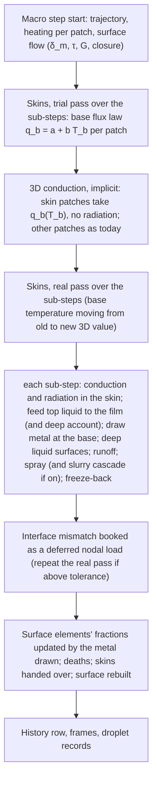

# Resolving the melt layer: a one-dimensional skin under every melting patch (Step 3 amendment) — Design

Date: 2026-10-07
Status: design for review, awaiting implementation plan
Amends: `2026-09-20-melt-spraying-design.md` §8 (melting), §9 (film and spraying) and §10 (geometry and accounting),
and therefore sub-plans `02-material-properties.md`, `03-thermal-core.md`, `06-melt-film.md`, `07-spraying.md`,
`09-melting-body.md`, `10-coupled-loop.md`, `13-cli-wiring.md`, `14-verification-runs.md` and `15-documentation.md`.
Builds on: the Step 3 amendments of 2026-10-02 (deep runoff), 2026-10-03 (molten cascade), 2026-10-05 (seeding;
runoff flux) and 2026-10-06 (rigid substrate, facts 78–87 — uncommitted when this was written; this design assumes it
is committed first). Fits, but does not depend on: `2026-09-27-surface-recession-remeshing-design.md` (sub-plans 16 and
17, not yet built). Nothing in Step 1 or Step 2 changes, and a run is bit-identical to today's until the first patch
reaches the solidus (§5.2). Numbers marked *measured* come from runs of the prototype; numbers marked *estimated* are
calculations made for this design and are to be measured in build stage 1.

## 1. Purpose

Step 3's droplet population depends on the macro step and, by every indication, on the surface mesh. Two mechanisms
were measured (§2): surface elements hand over liquid in pieces about one conjugate depth δ_m thick (the "lumps"), and
the runoff moves a whole step's film before the spray acts (the "pile-up"). Underneath both lies a resolution fact: the
first temperature node below the surface sits 4.6 to 17 conjugate depths down on every patch, so the 3D solution cannot
represent the melt layer that Girin's theory describes, its depth, or where the melting front is within it. Refining
the 3D mesh to resolve δ_m is unaffordable, because the eroding front recedes through most of the sphere's radius (§2).

This design gives every melting surface patch a **skin**: a one-dimensional column of fine cells, with the patch's
area, that owns the outermost metal of that patch. The skin resolves the melt layer and the slurry beneath it on its own
fine grid and on its own short sub-step; it feeds the film continuously; and the film's runoff and spraying are advanced
on the same sub-steps. The 3D mesh keeps its 2 mm surface elements and owns everything below the skins.

Deliverables: (1) a melt layer resolved to about a tenth of δ_m, with the liquid depth, the conjugate-depth gate and the
non-rigid depth read from it rather than from whole elements; (2) a continuous feed and a continuous recession of the
surface, so that no liquid reaches the film in element-sized pieces; (3) the film's runoff, spraying and freeze-back on
sub-steps of about 10 ms; (4) Asha's slurry cascade, behind a switch (§8); (5) exact mass and energy books throughout;
and (6) a droplet population that no longer depends on the macro step or the surface mesh (the acceptance criterion,
§12.3).

## 2. Facts this design relies on

| Topic | Fact | Source |
|---|---|---|
| The surface elements do not resolve δ_m | Over the surface patches of the 100 mm flight (frames at 0, 60, 80 and 100 s, 0.5 s step), the first node below a patch sits a median 2.18–2.26 mm deep (5th–95th percentile 1.60–3.14 mm) and a surface element holds a median 0.73–0.75 mm of metal per unit area (5th percentile 0.53 mm at 100 s, 0.60 mm at 0 s). On the patches under Girin's closure δ_m is a median 230–304 µm (5th–95th 211–367 µm), so the first node sits a median 7.3–8.0 δ_m down (5th–95th percentile 4.6–17); **no** patch has a node within one δ_m and 0.1 % within two. The mesh is 2 mm elements throughout a 15 mm band, graded to 8 mm in the core. | measured 2026-10-07 (frames of the fixed-flux 0.5 s run) |
| The front recedes through most of the radius | Recession below the original sphere: deepest 16.6 mm at 50 s (the continuum switch), 29.0 mm at 60 s, 43.0 mm at 80 s, about 50 mm (the centre) at 90–100 s; 95th percentile of the surface 8.9, 10.7, 12.5 and 13–14 mm. The rear half is untouched. | measured 2026-10-07 (same frames) |
| Thin layers fixed to the original surface are unaffordable | Prism layers of 0.1 mm over the 2 mm facets add about 56 000 tetrahedra per layer: 8.5 million to 15 mm deep, 28 million to 50 mm, against today's 177 000. Graded layers (0.1 mm growing 10 % per layer) reach 50 mm in about 40 layers but are already about 1 mm thick at 10 mm depth. | estimated 2026-10-07 |
| What builds the films that go to the thick branch | Probe run at 0.0125 s after the continuum switch, 49.5–80 s: films deeper than δ_m at release carry 19.5 % of the released mass (median 1.43 δ_m); the liquid below the film adds nothing to the branch test at this step. For 63 % of that mass the patch held no film at its previous spray stage. By route: runoff converging onto the patch 47 %, the patch's own surface element's feed 32 %, hand-over at a death 10 %, carry-over 11 %, deep surfacing 0.2 %, molten cascade about 0. The feed lumps are about a quarter of large exposed elements (2–6 times the median facet area), about 1.2 δ_m at once. | measured 2026-10-06 (film-provenance probe; not yet recorded as Step 3 facts) |
| The lumps do not shrink with the step | Over 49.5–59.5 s, the films deeper than δ_m at release have a median 1.47–1.54 δ_m and a largest single arrival of 1.10–1.15 δ_m at every step from 0.05 to 0.00625 s; their share of the mass falls 37.1, 27.6, 20.4, 15.8 %; the surface elements' feed events of at least δ_m fall 653, 462, 368, 322 per second (29, 20, 13 % fewer per halving). Gross feed and freeze-back both rise with every halving (feed 14.5 to 21.8 g/s, freeze-back 1.5 to 8.5 g/s); their difference stays near the release, about 13.3 g/s. | measured 2026-10-06 (same probe) |
| Shrinking the step alone does not converge | Fixed-flux model, 100 mm flight, switched at 49.5 s to 0.05/0.025/0.0125/0.00625 s: droplets 87.7, 106.6, 126.5, 141.2 million; thick share 47.0, 35.3, 25.1, 20.5 %; the last halving still moves the count 11.6 % and the thick share 4.6 points, 27 and 29 times their scatter between seeds. | facts 75 and 77 |
| The release is limited by supply | The spray's capacity exceeds the melt supply by hundreds of times; the spray instability grows in a median 0.16–0.19 ms. | facts 9 and 69 |
| Film speeds | Wall shear about 30–32 Pa on the windward patches at 60–80 s; a 10 µm film moves at about 0.25 m/s, a layer sheared over δ_m at about 8 m/s, a 1 mm layer under the pressure gradient at about 10 m/s. | measured 2026-10-05; fact 47 |
| The slurry is deep on the linear law | Under the rigid-substrate rule the non-rigid depth under wet windward patches is a median 8.1 mm on `AA7075_range` and 1.45 mm on `AA7075_scheil`; T_rigid (half liquid) is 829.0 K and 895.10 K. | facts 78, 82 and 84 |
| Slurry viscosity | Li Yageng et al. (2014): η = [0.871 − 0.00849 γ̇^0.74924] exp(3.7311 f_s) Pa·s, 0.87–5.6 Pa·s at low shear rates, measured at f_s = 0.1–0.5 and γ̇ = 61–490 1/s (γ̇ held at most 367 1/s); a log-linear bridge to liquid aluminium's 1.3 mPa·s near the liquidus (labelled, no data). That is 670–4 300 times the liquid. | Step 4 plan §4; semisolid AA7075 report |
| What a step costs today | About 2.4 s per 0.5 s step on this laptop; 1.2–1.9 s per fine step at 0.0125–0.00005 s. | facts 50 and 76; measured 2026-10-06 |
| The skin–3D coupling must be implicit | The skin's base conductance is about k/s = 128 W m⁻¹ K⁻¹ / 0.4 mm ≈ 3.2 × 10⁵ W m⁻² K⁻¹; a 3D surface node holds about 2 × 10³ J m⁻² K⁻¹ (ρ c_p ≈ 3.2 × 10⁶ J m⁻³ K⁻¹ over about 0.6 mm). An explicit hand-over is stable only for macro steps below about 6 ms and amplifies a base-temperature error about eighty-fold at 0.5 s. | estimated 2026-10-07 |

## 3. Scope

In scope: the skin (§5); its coupling to the 3D conduction in time (§6); the film, deep account and spray on its
sub-steps (§7); the slurry cascade, switched (§8); deaths, hand-over and remeshing with skins (§9); settings, outputs
and code layout (§11); verification (§12).

Out of scope, recorded in §14: slurry runoff (slurry moves only by spraying); raising `PHI_DEATH` to 0.50; the choice
of Step 3's default material law; lateral conduction within skins; a skin that refines anything other than the depth
direction. Step 4's rigid-mesh mechanics and the large-fragment (Spheral) model are not changed; §8.5 records the one
boundary that moves.

## 4. Architecture

The skin is a new module (`reentry_model/skin.py`) holding every skin as arrays and solving them together. The melting
body (`body.py`) orchestrates the macro step. `film.py` and `spray.py` are called once per sub-step through their
present functions. Each thermal backend gains one boundary condition (§6.2).

## 5. The skin

### 5.1 What a skin is

A skin belongs to one surface patch. It has that patch's area A and outline — it is a slab under the patch, not a pin —
and is resolved only in depth: temperature, liquid fraction and enthalpy vary along the patch's inward normal and are
uniform across the patch. Its target thickness is `s = 0.4 mm` (setting), about 1.1–1.9 δ_m and thinner than the metal
95 % of surface elements hold per unit area (§2), so creating a skin never empties its element at once. It is divided
into equal cells of `Δz = 10 µm` (production) or `20 µm` (development) (settings). Each cell holds its mass and its
enthalpy; temperature and liquid fraction follow from the material's own enthalpy law (`Material.enthalpy`,
`temperature_from_enthalpy`, `liquid_fraction`), and conductivity from `Material.k`, so the skin uses exactly the 3D
model's material, linear range or Scheil.

### 5.2 When a skin is created

A patch gets its skin the first time either its surface temperature (the facet mean of the 3D surface nodes) reaches
the material's solidus, or film first arrives on it, whichever comes first. Until then the patch is an ordinary 3D
boundary, so a run is bit-identical to today's until the first creation, and every non-melting run and the Step 1 and
Step 2 verifications against SESAM are untouched.

At creation the skin takes a slab of thickness s (less if the element cannot supply it while keeping φ_e above
`PHI_DEATH`) from the patch's surface element. Its cells are filled from the 3D temperature field along the patch's
inward normal, read through the P1 field exactly as the rigid-substrate amendment's `nonrigid_depth` line does. The mass
leaves the element through φ_e at the element's enthalpy as the solver weighs it, and arrives in the cells at the
enthalpy of the field where each cell lies; the difference is booked to the element's nodes as a deferred load, the rule
every transfer in the melt step already follows. Mass and energy are exact.

### 5.3 What the skin owns, and what the 3D mesh owns

The skin owns the outermost metal of its patch. Its top is the metal's real surface: it receives the patch's convective
heat flux and radiates εσ(T_top⁴ − T_amb⁴) over the patch's full area A from its top cell's temperature. On a skin patch
the 3D surface nodes no longer sit at the surface — their temperature is that of the skin's base, about 0.4 mm down — so
the 3D model's radiation is switched off there (§6.2). Every quantity that reads "the wall temperature" uses the skin's
top on a skin patch: the heating (with the start-of-step wall temperature, as today), the surface-flow evaluation, the
film temperature and the molten region of the wave-fits test.

The 3D mesh owns everything below the skins. Its boundary condition on a skin patch is the heat flux leaving the skin's
base (§6). The skin keeps the facet's area as the surface recedes through it; on a 50 mm radius a 0.4 mm skin changes the
true area by about 1.6 %, and the area is reset when the surface is rebuilt at a death. This is an approximation of the
design (§13).

### 5.4 Inside a sub-step

The skin's enthalpy equation is solved implicitly on each sub-step (backward Euler, the cells' conductivities at their
current temperatures, Newton on the enthalpy as the 3D solver does), with the heat flux and radiation at the top and
the base condition of §6. The film's heat capacity is added to the top cell (§7.2). All skins are solved together: each
is a tridiagonal system, and the systems are solved side by side in one vectorised sweep.

**Feed.** After conduction, the contiguous cells from the top at or above `T_feed` (the model's existing top-of-ramp
temperature, 910 K for `AA7075_range`) are liquid. On a patch under Girin's closure, the part within δ_m of the top
goes to the film and the contiguous liquid deeper than δ_m goes to the deep account, never sprayed (the three-zone rule
of fact 46). Off the closure there is no δ_m and all of it goes to the film, as today. Partly liquid cells — the slurry
and the mush — stay in the skin.

**Draw.** The skin keeps its thickness by drawing the same mass in at its base from the patch's surface element, at the
temperature of the element's top (the facet mean of the 3D surface nodes); the element's mass leaves through φ_e at its
solver-weighted enthalpy and the difference is booked to its nodes as a deferred load. φ_e therefore falls smoothly, and
the surface recedes continuously rather than one element per death.

**Regridding.** Removing liquid from the top and adding metal at the base is done by a conservative remap of the cells
onto an even grid over the skin's current thickness, which keeps the profile, the mass and the enthalpy exactly.

**Thickness bounds.** A skin may run between s/2 and 2s. Below s it draws; above s (after a hand-over, §9) it stops
drawing until melting brings it back. If its element cannot supply enough within a macro step, the skin thins and the
next element supplies it after the death. Every such event is counted (§11.2).

### 5.5 Depths read from the skin

- **Liquid depth**: the contiguous liquid from the top, exact to the cell, interpolated linearly within the boundary
  cell.
- **Non-rigid depth**: the depth from the top to the first point at T_rigid (half liquid). Within the skin it is read
  from the cells; where the slurry runs deeper than the skin, it continues into the 3D field from the 3D surface along
  the inward normal by the rigid-substrate amendment's existing line method, and the two parts add.
- The rigid-substrate amendment's **regime layer** — film plus deep account plus non-rigid depth — is assembled from
  these, so `film.lubrication`'s branch flag and surface velocity and the spray's regime test read a resolved layer.

## 6. Time-stepping and the skin–3D interface

### 6.1 Two clocks

The **macro step** Δt (CLI `--dt`, 0.5 s by default) is the 3D conduction's, the trajectory's and the surface flow's
step, as today; the heating, δ_m, the wall shear, the pressure gradient and the closure are evaluated once per macro
step. The **sub-step** δt (`--skin-substep`, 10 ms by default, 50 per macro step) is the skins' and the film's. A melt
front at about 2 mm/s crosses about two cells of 10 µm per sub-step, which the implicit enthalpy method handles while
conserving energy exactly.

### 6.2 The interface

An explicit hand-over — the skins running the macro step against the start-of-step 3D temperature and the 3D model
receiving what left their bases — is unstable at the macro step (§2, last row). The interface is therefore made
implicit by a linearised flux law solved inside the 3D step:

1. **Trial pass.** Each skin runs through the macro step's sub-steps with its base held at the start-of-step 3D
   temperature T_b⁰ and records the energy E_b⁰ that left its base, and, by one extra tridiagonal solve per sub-step,
   the derivative of that energy with respect to the base temperature, giving a per-patch law
   q_b(T_b) = (E_b⁰ + (∂E_b/∂T_b)(T_b − T_b⁰)) / Δt. The trial pass applies the feed and draw to a copy of the skins'
   state, so that its base energy reflects them, and then discards the copy: nothing it does is kept.
2. **3D solve.** Each backend applies, on the facets of skin patches, the boundary flux q_b(T_b) with T_b the facet's
   own temperature — an affine boundary condition that enters the implicit solve exactly as the radiation condition
   does today — and no radiation. Other facets keep q_conv and radiation.
3. **Real pass.** The skins run the sub-steps again with the base temperature moving linearly in time from T_b⁰ to
   the new 3D facet temperature T_b¹. This pass feeds, draws, moves the film, sprays, freezes back and books every
   transfer.
4. **Books.** The energy E_b¹ that the real pass sent through each base differs from what the 3D solve received,
   q_b(T_b¹) Δt, by a small mismatch; it is booked to the facet's three nodes as a deferred load, so the global energy
   balance is exact. The mismatch is recorded every step; if on any patch its magnitude exceeds `INTERFACE_TOLERANCE` (a
   constant, 10⁻³ of that patch's base energy over the step), the whole step repeats the 3D solve and the real pass once,
   with every law re-linearised about T_b¹. Repeats are counted, and stage 1 measures how often they happen.

Rejected: a **monolithic** solve with the skin cells as extra unknowns in the 3D system (exact and unconditionally
stable, but it embeds thousands of one-dimensional chains in both backends' assembled systems — awkward in FEniCSx —
and forces the skins onto the macro step, so the film and spray could not be sub-stepped); an **explicit** hand-over
with a macro step of a few milliseconds (the cost this design exists to avoid).

## 7. The film, the deep account and the spray on the sub-steps

### 7.1 Order within a sub-step

For every skin together: (1) conduction (§5.4); (2) feed and draw (§5.4); (3) deep liquid surfaces into the film
(§7.3); (4) the film runs off for δt (`film.Runoff.transport`, with the runoff-flux amendment's flux on thick patches);
(5) the spray releases what each patch's mode allows in δt (`spray.SprayModel.evaluate`), with the slurry cascade if it
is on (§8); (6) freeze-back: film on a patch whose top cell has fallen below the ramp refreezes into the top cell (the
mirror of the feed, netted with it in the sub-step, as today but into the skin rather than the 3D element). The
front-surface Rayleigh–Taylor mode is evaluated each sub-step like the other modes.

### 7.2 Where the film sits

The film rides on its patch's skin: its temperature is the top cell's, and its heat capacity is added to the top cell
through the liquid enthalpy, exactly as `set_film_mass` adds it to the 3D surface nodes today. `film_enthalpy` and every
transfer rule keep their form; only the place changes. Because a patch gets a skin when film first arrives (§5.2), film
always has a skin to sit on and to freeze into, and the film is never carried by the 3D surface nodes on any patch.

### 7.3 How fast deep liquid becomes film (decided 2026-10-07: option b)

Deep liquid (the deep account, fact 46) becomes film from the top at the rate the gas shear re-establishes over newly
exposed liquid: up to ρ_l δ_m A per renewal time τ_r = δ_m²/ν_l (about 0.1–0.16 s here, fact 53 (c)), as far as the film
is thinner than δ_m. This replaces "at most one skin's worth per macro step", a resolution choice that made the rate
depend on the step; τ_r does not depend on either clock. The deep account's sideways movement (`_deep_runoff`) stays at
the macro step, because it reaches its steady state well within one (fact 47). Liquid held in 3D elements below the skin
(the molten chain below the wall) is still mobilised by the existing deep runoff.

### 7.4 What this changes

The film now receives a sub-step's melt — micrometres — rather than a quarter of an element, so the feed lumps of §2 are
removed by construction. The spray acts every 10 ms rather than every 0.5 s, so a film that reaches its stability
threshold is released within one sub-step: in 10 ms a film moving at 1–2 m/s travels 10–20 mm, against metres within a
0.5 s step. The release stays supply-limited at 10 ms, which is still about 60 instability growth times.

### 7.5 Droplet records

On sub-steps the source table would grow fiftyfold, so it is combined: one record per patch, per spray mode, per macro
step, summing the droplet number and mass over the sub-steps. Within a macro step a patch's droplet radius is fixed by
that step's gas state and δ_m on every branch, so combining changes no radius; the size histograms are accumulated
each sub-step and stay exact. Two columns are added to `SOURCE_COLUMNS`: `solid_fraction` (0 for liquid droplets) and
`h_kg` (the enthalpy per kilogram the droplets carry).

## 8. The slurry cascade (`--slurry-spray on|off`, default off; decided 2026-10-07)

### 8.1 The rule

Slurry — skin metal more than half liquid but not fully liquid — can spray, but only once nothing liquid covers it: no
film, no fully liquid cell above it and no deep liquid on the patch. Within a sub-step the spray works through time in
order: the film first, at its mode's rate; if the film is emptied before the sub-step ends, the remaining time strips
the exposed top slurry cell at the rate Girin's model gives for that cell's properties; then the next cell; until either
the sub-step's time is used or a cell at or below T_rigid (half liquid) is reached. The skin draws at its base as usual,
so the cascade can work through slurry deeper than the skin.

### 8.2 Properties of the exposed slurry

- Viscosity: Li Yageng et al.'s (2014) law at the cell's solid fraction (§2), the same law and bridge the Step 4 plan
  uses, evaluated at the shear rate of the slurry's own sheared layer (V_s/δ_m for that layer), found by fixed-point
  iteration (at most five passes; the shear rate held at no more than 367 1/s, as the Step 4 plan does).
- Surface tension: 0.80 N/m, the large-fragment design's labelled assumption for slurry.
- Density: the cell's mixture density.
- δ_m, V_s, the surface Weber number and the release rates: Girin's formulas, unchanged, with these properties.
- The regime test for the slurry layer: the layer runs from the exposed top to the first point at T_rigid (the
  rigid-substrate rule's layer); it takes the thin branch where that layer is no deeper than the slurry's own δ_m and the
  thick branch where it is deeper.

### 8.3 What to expect (estimated, to be measured in stage 3)

The slurry is 670–4 300 times as viscous as the liquid (§2). δ_m grows as the two-thirds power of the melt's kinematic
viscosity, so the slurry's δ_m is about 75–260 times the liquid's — centimetres — and a slurry layer of 1.5–8 mm will
usually take the thin branch. On the thin branch the surface speed of a sheared layer is inversely proportional to the
viscosity, so the surface Weber number falls by the square of the viscosity ratio, and by this estimate exposed slurry
will rarely pass the stability gate We_s > 4.62. If it does pass, Girin & Kopyt's thin mode is inviscid, so its
droplets would be the size of liquid droplets. Whether the cascade matters is therefore an open, measurable question;
stage 3 measures it.

### 8.4 Droplets of slurry

Slurry droplets carry their cell's solid fraction and enthalpy (§7.5). Their Weber and Ohnesorge numbers are computed
with the slurry surface tension and viscosity, as the large-fragment design does for fluid fragments.

### 8.5 The boundary with the large-fragment model

With the cascade on, Step 3 strips slurry from the surface into droplets; the large-fragment (Spheral) model keeps the
bulk slurry's breakup into large fragments (its loss-of-strength route) and reads the frames after the stripping, so
nothing is counted twice. When this design is approved, the large-fragment design's three-zone rule gains this sentence.

### 8.6 Why a switch

The skin's purpose is resolution. The cascade is new physics. Off for stages 1 and 2, any change in the droplet
population can be attributed to resolution; stage 3 then measures the cascade on against off on both material laws.

## 9. Deaths, hand-over and remeshing

**Death.** A surface element drawn down to `PHI_DEATH` (0.05, unchanged) dies as today. Its remaining metal moves into
the skin above it, at its base, at the element's solver-weighted enthalpy — not to the film as today, which turned the
remainder into liquid without paying for it. The surface is rebuilt as today; the dead element's other faces become new
patches, including the sloping walls of the crater a death leaves.

**Hand-over.** The dying patch's skin passes to the newly exposed patches by area, the rule the film uses today
(`NEAREST_PATCHES` by area), layer by layer: depth is measured as a fraction of each skin's thickness, the old skin's top
cells go to the new skins' top cells, and where several old skins hand to one new patch the cells are mixed by mass and
enthalpy. The film and the deep account on the dying patch go with it, as today. A newly exposed patch whose share gives
it less than s draws to s; one given more stops drawing (§5.4). A skin placed on a steep crater wall carries a profile
that was horizontal: an approximation (§13).

**Remeshing (sub-plan 17, when built).** At a remesh each skin is mapped to the new surface by the same area rule and
the 3D field is interpolated as the remeshing design plans. The skins carry the fine near-surface profile, so the coarse
interpolation no longer needs to preserve it. The derived surface of sub-plan 16 works unchanged, because skins live on
the mesh's facets; its surface position must add each patch's skin thickness, which this design provides.

**End of flight.** If the 3D body runs out of elements, the skins' metal stays in the books; demise is declared when the
total mass — 3D elements and skins together — is gone.

## 10. What is retired and what is kept, with `--surface-model skin`

| Mechanism | With skins | Why |
|---|---|---|
| Surface elements' feed by nodal feed fractions | retired on skin patches | the source of the lumps; the skin feeds continuously |
| Molten cascade (`_feed_exposed`) | retired | the skin draws through molten elements continuously |
| Death hand-over of the remainder to the film | replaced: remainder to the skin | the remainder is solid or mushy metal |
| Film on the 3D surface nodes | replaced: film on the skin's top cell | the top cell is the real surface |
| Freeze-back into the 3D element | replaced: into the skin's top cell | as above |
| Whole-element depths in the branch test | replaced: §5.5's resolved depths | resolution |
| Interior elements' feed to the nearest patches | kept (rare: needs liquid within δ_m of a patch below a skin) | unchanged physics |
| Deep runoff of liquid held in 3D elements | kept | three-zone rule, zone 2 |
| Rigid-substrate rule | kept, reading resolved depths | decided 2026-10-06 |
| Element death at `PHI_DEATH` = 0.05 | kept | comparability (§14) |
| Surface flow and heating once per macro step | kept | the gas state changes over seconds |

`--surface-model elements` restores every row exactly as before.

## 11. Settings, outputs and code layout

### 11.1 Settings

| Setting | Default | Run-name suffix when not default |
|---|---|---|
| `--surface-model skin\|elements` | `skin` | `_surface-elements` |
| `--skin-thickness` (mm) | 0.4 | `_skin<value>mm` |
| `--skin-cell` (µm) | 10 | `_cell<value>um` |
| `--skin-substep` (ms) | 10 | `_sub<value>ms` |
| `--skin-preset dev\|production` | `production` | `_skin-dev` (sets 20 µm cells) |
| `--slurry-spray on\|off` | `off` | `_slurryspray-on` |

The cell and sub-step defaults are provisional: stage 1's convergence and cost measurements fix them, and the decision
is recorded with its measurement. Each material file that melts gains the slurry viscosity law (§8.2) under its liquid
properties. A malformed value exits with code 2, as every setting does.

### 11.2 Outputs

History, per macro step: `skin_count`, `skin_mass_kg`, `skin_thickness_min_mm`, `skin_thickness_median_mm`,
`skin_drawn_mass_kg` (cumulative), `skin_handover_mass_kg` (cumulative), `skin_short_events` (cumulative, §5.4),
`interface_mismatch_J` (the step's sum of |mismatch|), `interface_repeats` (cumulative), `liquid_depth_mean_um` and
`liquid_depth_max_um` (resolved), `nonrigid_depth_skin_mean_um`, `slurry_sprayed_mass_kg` (cumulative) and
`skin_wall_s`. Surface frames gain per patch: `skin_T_top`, `skin_liquid_depth`, `skin_nonrigid_depth` and
`skin_thickness`, so the large-fragment model's inputs carry the resolved near-surface layer. Results gain the
cumulative skin quantities. The droplet records gain `solid_fraction` and `h_kg` (§7.5).

### 11.3 Code

- `reentry_model/skin.py` (new): `SkinField` — per-skin arrays (patch, area, thickness, cell masses and enthalpies,
  owner element), the vectorised implicit sub-step, the base-flux sensitivity, feed and draw, regridding, the slurry
  cascade's time-sharing, the depths of §5.5, and the hand-over remap.
- `body.py`: the macro step of §4; skin creation; the death and hand-over path.
- `film.py`, `spray.py`: unchanged interfaces, called per sub-step; `spray.py` gains slurry properties for §8.
- `material.py`: the slurry viscosity law.
- `thermal/skfem_backend.py`, `thermal/fenicsx_backend.py`: the per-facet affine flux q_b(T) = a + b T with radiation
  off on those facets.
- `coupled.py`: history columns and frame fields. `cli.py`: settings and run names.
- Tests: `tests/test_reentry_model_skin.py` (new) and extensions to the film, spray, melting, coupled, CLI and FEniCSx
  test files.

Documents: this spec, then dated amendments to the sub-plans listed in the header, with facts in the shared context,
tested in a throwaway copy of the prototype, as every Step 3 amendment is.

### 11.4 Laptop and cluster

The development preset (20 µm cells) is for building and testing on the laptop; the production preset is for the
cluster, used in two ways: many flights side by side, one per core, for the step, grid and seed studies; and the FEniCSx
backend's parallel solver for the 3D conduction on finer meshes. The skins stay vectorised arrays in one process; each
skin is independent within a sub-step, so they can be split across processes later if they become the bottleneck.

## 12. Verification and acceptance

### 12.1 Build stages

1. **Stage 1 — skins with melting only.** Creation, the interface (§6), feed and draw, deaths and hand-over. The film
   and spray still run once per macro step, fed by what the skins melted over the step.
2. **Stage 2 — the film and spray on the sub-steps** (§7), including freeze-back into the skin and deep liquid on the
   renewal time.
3. **Stage 3 — the slurry cascade** (§8), on against off.

Each stage is tested and measured before the next begins.

### 12.2 Tests

Against exact solutions, the skin alone: (a) a semi-infinite solid under constant heat flux; (b) Neumann's melting
problem, melt kept in place, liquid depth growing as √t; (c) steady ablation, melt removed as it forms — recession speed
q / (ρ (L + c_p ΔT)) and an exponential profile ahead of the front. The skin coupled to a coarse 3D box mesh
(`box_mesh`) against a very fine 3D box mesh on the same one-dimensional ablation problem: the skin must recover the
fine-mesh recession and surface temperature without the fine mesh, at macro steps from 0.05 to 0.5 s, with no
oscillation and a small interface mismatch. Books exact through creation, draw, deaths, hand-overs and the cascade (the
existing balance measures). Bit for bit: identical to today until the first skin is created; `--surface-model elements`
reproduces the earlier 50 mm and 100 mm flights; `--slurry-spray off` changes nothing. Both thermal backends agree with
skins active. The cascade's rules: no slurry sprays under film, liquid or deep liquid; stripping stops at T_rigid; the
time-sharing adds up exactly.

### 12.3 Flight measurements and the acceptance criterion

The 100 mm flight to 120 s on both material laws and the 50 mm flight. Every comparison is read against the scatter
between two seeds measured at the same step, because the scatter grows at small steps (fact 75).

- Sub-step and cell: 20/10/5 ms and 20/10/5 µm; these fix the presets.
- Skin thickness: 0.4 against 0.8 mm; a change would mean the skin is too thin to hold the melt layer.
- **Acceptance** (end of stage 2): the droplet count, the thick-branch share of the sprayed mass, the median droplet
  radius by number and by mass, the sprayed mass and the mass at 120 s each agree within the scatter between seeds when
  (i) the macro step is halved, 0.5 against 0.25 s, and (ii) the surface mesh is refined, `--h-surface` 2.0 against
  1.4 mm. A 0.125 s run is made as a check on (i) but is not part of the criterion.
- If acceptance fails, the film-provenance probe (§2) is adapted to the skins and the cause is diagnosed before anything
  is tuned.
- Cost: seconds per macro step and peak memory at each preset on the laptop.

## 13. Risks and approximations

- The interface mismatch may be large at a 0.5 s macro step during rapid changes in heating, forcing frequent repeats;
  stage 1 measures the repeat rate.
- A skin's area stays the facet's as the surface recedes through it (about 1.6 % on a 50 mm radius) until the next
  rebuild.
- Skins handed onto steep crater walls carry a profile that was horizontal.
- Lateral conduction within the skins is neglected: gradients along the surface (over about 2 mm) are far weaker than
  through the melt layer (over about 0.3 mm).
- The runoff on sub-steps may cost more than estimated (about 1–2 s per macro step at 50 sub-steps, estimated).
- The cascade applies Girin's theory to a non-Newtonian layer with a viscosity law measured only at 61–490 1/s.
- Neither remeshing (sub-plan 17) nor the derived surface (sub-plan 16) is built; the design fits them but is untested
  with them.

## 14. Open items, for later decisions

- Slurry runoff (slurry moving along the surface, not only spraying), with its own decision on the Step 3 /
  large-fragment boundary; at present slurry is immobile except through the cascade. On the linear law the slurry runs a
  median 8.1 mm deep (fact 82), so this may be among the most consequential open physics questions in Step 3.
- `PHI_DEATH` 0.50 (fact 44): recommended for elements consumed in large bites; with skins an element is drawn smoothly
  and its death is a geometric event, so the question is re-measured once the skins work.
- Step 3's default material law: the slurry depth differs fivefold between the linear range and Scheil (facts 82, 84).
- Whether the macro step itself can be raised once the skins and film are sub-stepped.

## 15. Assumptions to state in the thesis

1. The melt layer under each surface patch is one-dimensional: properties vary with depth and are uniform across the
   patch.
2. The skin keeps its facet's area as the surface recedes through it, until the surface is rebuilt.
3. Deep liquid surfaces into the film at the shear's renewal time δ_m²/ν_l.
4. (Cascade on only.) Exposed slurry sprays by Girin's model with Li Yageng et al.'s viscosity at its own shear rate and
   a surface tension of 0.80 N/m; it sprays only when no liquid covers it.

## 16. Alternatives considered

- **Coupling.** (B) an overlay that reconstructs the profile within the surface element from the 3D field and the
  heating, the 3D model keeping all metal and its boundary: no solver change, but two descriptions of the same metal
  that can drift apart, the 3D surface still overheating within each step and setting the radiation and film
  temperature, and no clean way to sub-step the film. (C) a quasi-steady ablation layer: cheapest and step-independent,
  but it assumes the layer is always steady, which fails at onset, cooling and freeze-back, and cannot follow a slurry
  layer that changes. Chosen: (A), the moving skin.
- **Resolution in the 3D mesh.** Prism layers fixed to the original surface, deepened to where the front recedes:
  8.5–28 million tetrahedra (§2). A thin prism stack that follows the surface by remeshing: about 0.6 million extra
  tetrahedra and a remesh about once per second of flight; kept as the alternative if the skins fail acceptance.
- **Interface in time.** Monolithic and explicit schemes, rejected in §6.2.
- **Scope.** Melting only, without sub-stepping the film and spray: would leave the runoff pile-up, the larger of the two
  measured causes (§2).
- **Slurry.** Kept immobile entirely; or runoff only; or runoff and spray. Chosen: Asha's cascade (§8), switched.
- **Deep liquid.** "One skin per step" on the sub-steps (fifty times faster than now, for no physical reason); deep
  account entirely at the macro step. Chosen: the renewal time (§7.3).

## 17. Decisions of record

- 2026-10-07: option 2 of the resolution discussion — a one-dimensional model of the melt layer, not a finer 3D mesh;
  development on the laptop, production on the cluster (not a requirement that production run on the laptop).
- 2026-10-07: scope (b) — melting plus the film and spray on the skins' sub-steps, designed as one piece and built in
  stages.
- 2026-10-07: coupling (A), the moving skin; Section 1 approved with s = 0.4 mm and skins created only where melting
  begins (or film arrives).
- 2026-10-07: the skin radiates from its top cell over the patch's full area (the column has the patch's area).
- 2026-10-07: Section 2 (two clocks, the linearised interface) approved.
- 2026-10-07: Asha's slurry cascade, behind `--slurry-spray`, off for the resolution tests and measured in stage 3.
- 2026-10-07: deep liquid becomes film on the shear's renewal time (option b).
- 2026-10-07: Sections 3–6 approved.
